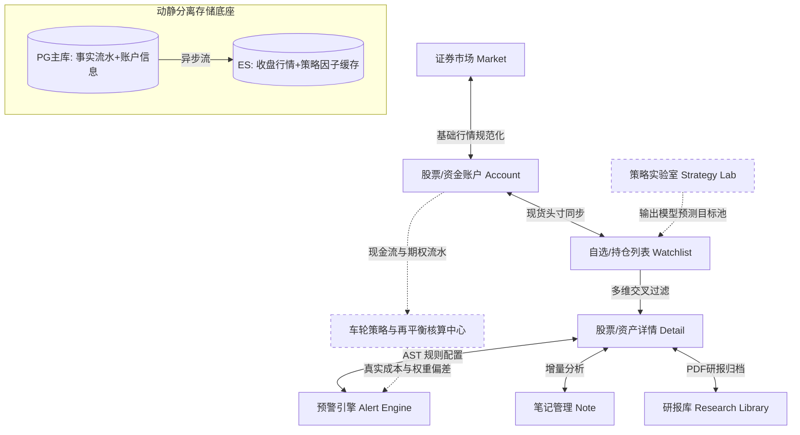

# Portfolio 投资大模块总体产品需求文档 (Master PRD)

| 字段         | 内容                                                     |
| ------------ | -------------------------------------------------------- |
| **产品名称** | Portfolio 投资综合控制台                                 |
| **版本**     | **V1.0 (数据与监控基石) / V2.0 (高阶衍生品闭环规划)**    |
| **核心定位** | 面向长期左侧价值投资者与期权卖方的资产全景与策略执行中心 |
| **文档状态** | 架构规格与基线确立                                       |

---

## 1. 演进路线图与 V1/V2 边界划分

为保证系统的稳定落地，我们将极具挑战的金融级业务拆分为两期。**V1 的核心是“搭骨架、跑通数据与预留扩展”，V2 的核心是“接期权、控现金与闭环策略”。**

### 📊 V1.0（本期落地范围）—— 构建高可用数据与监控底座

1. **多券商现货资产合并**：跑通股票现货的导入与底层 `Position` 聚合（A股为主，支持自定义券商归属）。
2. **复合组合预警引擎**：上线混合型预警引擎，支持基本面因子（PE/PB/股息率）与绝对价格的级联短路求值。
3. **动静分离与多级同步**：实现 PostgreSQL（事实层） + ES（检索层）的双写分离，跑通每日收盘（EOD）批量数据调度与冷热归档。
4. **终端级交互重构**：完成「自选列表」动态分流、「股票详情」核心容器重构（引入同花顺固定底栏与富途顶部 Tab，**两阶段交付**：阶段一打通理杏仁 EOD 现有数据并预留实时扩展点，阶段二接实时源补盘中数据）。**PDF 研报独立成 §3.8 研报库 PRD**（详情页只承载入口）。
5. **基础交易流水留痕**：建立订单历史流水，支持多次建仓的历史买卖价回溯记录，并为 V2 的期权与复权预留全量接口。

### 🚀 V2.0（下期规划范围）—— 机构级交易闭环

1. **衍生品与期权车轮策略（Wheel Strategy）**：闭环权利金（Premium）流水与被行权正股，计算出真实的扣减权利金成本（Net Cost Basis）。
2. **现金流与流动性管理**：引入资金账户余额，提供左侧“购买力（Dry Powder）”视图，上线期权冻结保证金预警。
3. **分红/拆股成本自动复权**：同步公司行动日志，提供“真实复权成本”视图。
4. **资产目标仓位动态再平衡（Portfolio Rebalancing）**：上线权重漂移（Drift）告警。
5. **策略实验室（Strategy Lab）**：上线模型回溯引擎，支持“模型预测值 vs 股票真实走势”的长线对标追踪。

---

## 2. 全局业务板块与数据架构拓扑

---

## 3. 深度功能设计详述 (V1.0)

### 3.1 证券市场 (Securities Market)

- **业务定义**：系统全局 API 消费与流量分配的“准入网关”。
- **板块职责**：
- 默认激活 A 股（含北交所）。
- 港股、美股默认关闭，用户可根据自身资产配置手动开启。
- 非核心海外市场（如日本、新加坡）一律置灰，底层不执行任何节点初始化。联动控制生效后，全局模糊搜索、导入及行情轮询将彻底熔断对该市场端点的调用。

### 3.2 股票账户 (Stock Account)

- **业务定义**：跨多券商、多账号持仓归属的“标识字典池”。
- **板块职责**：
- 解决国内 A 股无法通过 API 获取持仓的痛点，作为后续导入股票资产数据的归属标记底座。
- 交互上采用 `Label -> Value` 下拉框形式，内置国内主流券商清单（华泰、中信、招商、东财等）。
- 用户选中券商后，需**手动输入自定义券商账户 ID**。此 ID 不作为底层业务主键（业务主键为市场+代码），而是作为外部 Excel 导入或系统对接时的归属映射字段，并在自选列表页中作为下拉过滤筛选器。

### 3.3 自选列表 (Watchlist)

- **业务定义**：资产总览与监控标的的“动态分流池”。
- **交互参考**：深度借鉴「同花顺」自选设计范式。
- **板块职责**：
- 顶部提供「持仓股」、「自选」、「自定义分组」、「追踪池」、「策略池」等多 Tab 页面。
- 「持仓股」由底层交易份额大于 0 的事实自动驱动，用户不可手动移出。
- 提供跨市场、跨账户的过滤器组合，并自动调取最新外汇牌价，将外币资产统一折算为人民币（RMB）进行合并展示。

### 3.4 股票详情 (Stock Detail)

> 详见 [子 PRD 05](portfolio-05-stock-detail-prd.md)。

- **业务定义**：个股深度研判综合容器。
- **交互参考**：借鉴「富途牛牛」顶部 Tab 与「同花顺」固定底栏。
- **板块职责**：
- **顶部 Tab（V1 保留 3 个）**：`图表(K线)` / `分析(研报容器)` / `公司(理杏仁财务·估值·分位)`。期权 → V2；轮证 / 评论 / 资讯 → V1 不做。
- **两阶段数据交付**（理杏仁无实时，per [03 技术设计](portfolio-03-data-provider-tech-design.md) §4-§5）：阶段一打通理杏仁 EOD 现有数据（报价 EOD 字段 + 日 K 及以上 + 财务估值）并**预留实时扩展点**；阶段二接入实时源后透明补充盘中字段 / 分时图 / 逐笔（端口不变，03 §7.3）。
- **固定动作底栏（同花顺式，4 项）**：`预警配置` / `写笔记` / `加·删自选(状态切换)` / `⋯更多工具(调分组·颜色标记 + 分享)`。
- **研报**：详情页「分析 Tab」仅承载入口 / 容器；完整 PDF 研报能力拆为 [§3.8 研报库](#38-研报库-research-report-library) 独立 PRD。

### 3.5 预警管理 (Alert Management)

- **业务定义**：基于布尔逻辑的多因子级联“自动化监控引擎”。
- **交互参考**：借鉴同花顺的条件预警配置逻辑。
- **板块职责**：在配置界面对海量因子指标进行树状组织（形态、基本面、估值）。用户勾选所需指标后，系统自动生成可视化表达式配置流（如：`price <= 85.00 && pe_ttm < 15`）。在交易时段执行 30 秒高频轮询，触发后锁定，实现微信 PushPlus 与飞书秒级分发。

### 3.6 笔记管理 (Note Management)

- **业务定义**：投资心智模型沉淀工具。
- **板块职责**：详情页就地唤出的版本化（Version + 1）增量记录工具，不破坏看盘上下文。支持与特定预警事件或策略做关联。

### 3.7 策略实验室 (Strategy Laboratory) —— V2.0 重点

- **业务定义**：策略回溯、校准与目标池输出的“独立决策大厅”。
- **板块职责**：脱离详情页的附属地位，独立运行模型算法对历史基本面进行数据回归计算，寻找目标股池并推入自选列表。同时记录模型对个股的预测值，与股票实际走势进行对标比对，验证并回溯模型有效性。

### 3.8 研报库 (Research Report Library)

> 独立 PRD（后续起草）；详情页「分析 Tab」（§3.4）仅承载入口 / 容器。

- **业务定义**：个股 PDF 研报的导入、存储、阅读与版本化管理工具。
- **板块职责**：
- 支持系统通过接口拉取**或**用户手动导入外部 PDF 研报文件，按标的（market+code）归档。
- 调用原生 / WebView 阅读器进行高性能双指缩放、翻页展示。
- 同一标的多版本研报的版本化（Version + 1）管理。
- **拆分理由**：依赖文件存储 / 导入基础设施（V1 尚无），体量足够独立成篇，做成完善能力，不拖累详情页核心容器交付。

---

## 4. 关键技术架构与深度专项设计

### 4.1 动静分离与冷热分层架构

应对海量行情数据的高频访问，系统从字段级别进行物理隔离：

- **静态业务事实（PostgreSQL 强一致落库）**：
  包括交易订单详细记录（买入价、卖出价、份额、规费）、账户映射关系、股票基础字典。不可篡改，支撑长线复盘与预警时的历史成本参考计算。
- **行情快照（Provider + 缓存）**：
  用户打开自选列表或详情时，最新价格、涨跌幅、实时 PE 走 Provider + Redis 缓存（TTL），不查事实库。
  **更正（per [03 技术设计](portfolio-03-data-provider-tech-design.md) §5）**：理杏仁**不提供实时行情**，仅 EOD 日线 + 基本面 + 财报 + 估值分位。故「最新价」由 `QuotePort` 提供——**V1 为 EOD 收盘兜底**，实时价待接独立实时 provider（候选：新浪/腾讯/东财 免费 L1 轮询，或 AllTick WebSocket，见 03 §9）后透明替换，消费者无感。

### 4.2 每日收盘 (EOD) 精细化数据同步网络

每日 16:00 触发的异步数据流同步，分为 PG 落库与 ES 索引召回两级，实行严格的按需拉取控制：

- **同步范围 (Which Rows)**：仅限关注池（持仓股、自定义组、追踪池、策略目标池）的去重并集。绝不无脑扫描 5000+ 股票。
- **同步频次 (When)**：高危告警池执行交易内 5min 轮询；常规池执行盘后每日 1 轮同步。
- **字段定级 (Which Fields)**：
- **P0（核心量价）**：收盘价、开盘价、成交量。每日更新。
- **P1（核心基本面）**：pe_ttm、pb、股息率。每日更新。
- **P2（相对位阶）**：行业 PE 历史分位。每日更新。
- **P3（定期财报指标）**：ROE、毛利率等。按财报季更新。

### 4.3 历史数据归档策略 (Data Archiving)

随着系统长期运行，日线（Daily Bar）数据将急剧膨胀，系统执行温冷分离策略：

- **热数据区 (Hot Data)**：存储于 PostgreSQL 的时序优化分区表或 Elasticsearch 中，保留最近 **1~3 年** 的行情与指标数据，直接支撑前端渲染与基础告警召回。
- **温冷数据区 (Warm/Cold)**：对于 3 年前的老旧数据。
- 依托 PostgreSQL 原生表分区（Partitioning），定期将老分区导出并压缩为 Parquet 或 CSV 格式，沉降至冷存储文件系统。
- 仅在“策略实验室”执行 10 年维度长周期宏观模型回归时，由引擎按需将冷文件数据挂载入内存，算完即焚，确保关系型主库的极简轻量。

### 4.4 AST 混合预警引擎架构 (Hybrid Eval Alert Engine)

为避免纯 SQL 轮询导致的 DB 风暴，以及纯 API 拉取导致的限流封禁，采用业内专业的“推拉结合混合求值”架构：

1. **冷数据前置召回**：每 30 秒轮询激活的表达式，首先读取本地同步的 ES/PG 慢变量（如 `pe_ttm`, `pe_percentile`）。
2. **逻辑短路防线**：若冷数据本身不满足阈值条件，立即执行逻辑短路终止解析，阻断外部网络请求。
3. **热数据内存融合**：冷数据校验通过后，针对高危触发临界点的标的，定向调用外部 API 提取最新 Tick 价格，在内存 AST 中完成最终布尔求值。满足条件即锁定告警并推送。

### 4.5 数据源降级解耦网络 (Fallback Chain)

屏蔽外部金融 API 差异，底层定义统一 Schema：

- **数据源特性定位**：
- 理杏仁：A 股主数据源（基本面强、极其稳定）。
- 富途牛牛：港美股主力源。
- Tushare / Baostock：A 股强力补充层与备用冷备源。
- AKShare：纯爬虫，稳定性差，作为极端边缘兜底源。

- **降级熔断**：当理杏仁发生 503 超时或配额耗尽，执行指数退避重试 2 次。失败后触发熔断期（5 分钟），流量无缝平移至下一顺位适配器。若所有源失效，抛出报警拦截，跳过本轮预警评估，杜绝假阳性动作。

---

## 5. 非功能需求与演进约束 (NFR)

1. **流水原子性保障**：第一期针对交易历史的任何写入与修改操作，在 NestJS 必须封装在单体强一致性事务内。这是 V2.0 计算真实复权成本与期权安全垫的基础。
2. **ES 宽容度扩展映射**：Elasticsearch 在建立指标映射（Mapping）时需启用动态拓展机制，以确保未来引入隐含波动率（IV）、期权 Greeks 等多维量化指标时，异步流写入无需停机重建索引。
3. **隔离与重试追补**：每日收盘数据从 PG 到 ES 的异步流同步，若遇到网络闪断产生偶发失败，坚决不允许回滚 PG 中的原始基准凭证。由内部死信队列（DLQ）接管并在网络恢复后执行最终一致性追补。
