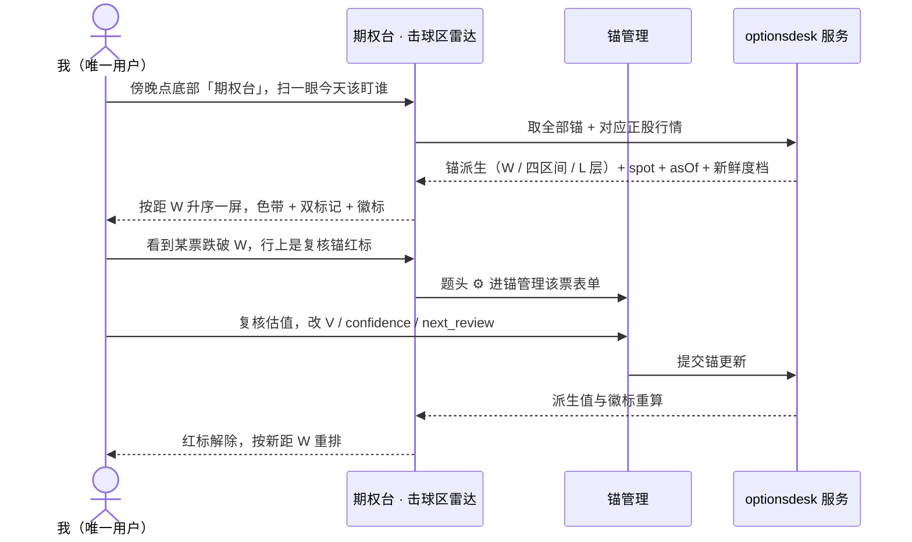

## User Journey Diagram

# Feature Specification: optionsdesk M1 — 锚管理 + 击球区雷达

**Feature Branch**: `045-optionsdesk-anchors-radar`
**Created**: 2026-07-31
**Status**: Clarified（2026-07-31 两轮共 15 问全部收敛：specify 阶段 10 项范围边界 + clarify 阶段 5 项欠定义面，见 § Clarifications）
**Input**: sell-put 可视化决策系统 p1 里程碑 **M1**（[p1 §8](../../docs/private/plans/2026-07/07-23-sellput-viz-p1-requirements.md)）= **P6 锚管理 + P1 击球区雷达**。需求 SoT = p1 §5（P1 / P6 两段）+ §3 七层映射；数据架构 SoT = [p3b](../../docs/private/plans/2026-07/07-30-sellput-viz-p3b-data-architecture.md) §4.7（跨 ctx 接线终态）+ §8（p4 输入清单）。

## 背景：这是新 bounded context 的第一片

本 feature 是 `optionsdesk` 这个新 bounded context 的**首次物理落地**。三条约束先内化，否则动手就撞闸：

1. **`optionsdesk` 只有决策、还没有代码**（07-31 定名，7Q 决策树 Q4 = Yes）。`business-naming.md` 明写「加新模块时 server 目录 + mobile 目录 + prisma schema 必须同时落地」，由 ESLint boundaries + Prisma CI 拦截 —— 所以模块登记与三处物理落地必须在**本 feature 的首个 impl PR 内一次做齐**（p3b §11 已登记此 DEFER）。
2. **跨 ctx 接线终态已定，不是本 feature 现场决策**（p3b §4.7）。本片涉及两个方向，都已定档：
   - optionsdesk **读** marketdata 的正股行情 → **Q7-B 跨 ctx 只读直查 + `CROSS-CONTEXT-READ` 注释**；禁 `@Inject()` marketdata 的 use case。
   - marketdata **反向读** optionsdesk 的锚表算自己的采集闸 → 由 marketdata 侧主动拉（逐字先例 `sync-tier-recalc.ts:89` 读 `portfolio.watchlist_item`）；**禁**把 optionsdesk 注册进 marketdata 的 `SyncDimension` / executor 钩子；降级纪律照抄 `sync-tier-recalc.ts:38-41`（读失败只 warn 不上抛）。
3. **注册面 6 条 checklist 漏一条就是静默放宽围栏**（p3b §4.7），其中第 3 条「把新 type 追加进现有 11 条 from 规则的每个 disallow 数组」最易漏 —— boundaries 是 `default: allow`，漏一处 = 静默给对方开了一条到我们这里的边。

**为什么 M1 是这两页而不是别的**：锚是整条决策链的输入端 —— L 层 / 单票上限 / 四区间 / 愿卖锚全部归属于锚，且无论来自 confidence 派生还是人工覆盖，生效 L 层都只存在于锚上一处；雷达是唯一不依赖期权链的消费面。M1 交付后「每天看谁进击球区」这件事就闭环了，且采集管道的工作集从此由锚表驱动（加第 8 只锚零代码改动）。

## 依赖与排期前提（硬前置，不是软假设）

本片**不采集任何行情数据**（Q1 = B）。雷达消费的美股正股行情由**另一个 worktree 的 Phase 1-2 工作**供给 —— **三项前置已于 2026-08-01 全部 ship 并在 prod 有数**（下表逐条挂 commit）：

| 依赖                               | 出处               | 影响本片的什么                                                                                                 | 状态                                                                                                                                                                                                                                                                                                                                                                                                                                                                                                                                    |
| ---------------------------------- | ------------------ | -------------------------------------------------------------------------------------------------------------- | --------------------------------------------------------------------------------------------------------------------------------------------------------------------------------------------------------------------------------------------------------------------------------------------------------------------------------------------------------------------------------------------------------------------------------------------------------------------------------------------------------------------------------------- |
| us universe 换源富途（标的库补全） | p3b §10 Phase 1 #4 | **US1 建锚**：ticker 必须从标的库搜索选择（Q8 = B），标的库不全则种子 7 票里 PEP / LULU / CPB / AOS 四票搜不到 | ✅ 已 ship（`5fd6ce68` / PR #747，连带退役东财 us 路径）                                                                                                                                                                                                                                                                                                                                                                                                                                                                                |
| US 交易日历换源富途 L1             | p3b §10 Phase 1 #5 | us-only 维度的 044 绊线（否则共享静默停摆风险）                                                                | ✅ 已 ship（`f44da8ce` / PR #746）                                                                                                                                                                                                                                                                                                                                                                                                                                                                                                      |
| 美股正股日线落库 + backfill        | p3b §10 Phase 2 #9 | **US2 雷达**：无行情则每行都走 `hasData=false` 降级态                                                          | ✅ **已 ship，10 年 backfill 亦已完成**（`21fd3c71` / PR #752 + 限频治本 `18b62bfc` / PR #762）—— prod 实测 2026-08-01（p3b E37 + E38）：种子 7 票已人工开闸（`need_sync`），`marketdata.daily_bar` us 落 **16,726 行**（`adjust='none'`，读时复权），逐票 vs `trading_day` **缺口 0**、重复 0，最深回看至 **2016-04-21（10.3 年）** ⇒ **雷达对这 7 票能出真值，长窗读数（RV 21d 之外）亦已可得**。⚠️ 仍存一条余量：新开的第 8 只锚在开闸后**首个 cron 跑完前**仍是 `hasData=false` ⇒ **降级态渲染仍是 MUST，不能因「现在有数」而省掉** |

**接线面是现成的、无需新契约**：既有读路径 `Instrument(market_code)` → `DailyBar(instrumentId, adjust:'none', 最新 tradeDate)`（`eod-backed-quote.adapter.ts:35-45`）**完全 market-agnostic，零 cn/hk 硬编码**；`QuoteSnapshot`（`marketdata.types.ts:138-150`）已带 `asOf` / `priceKind` / `hasData` 三件套。us 日线一旦落进 `DailyBar`，本片读端**零改动自动有数**。

✅ **原「待与另一 worktree 对齐」的事实已落定（08-01 / #752）**：`us_equity_bar` 是**纯 seed 无 DDL** 的新维度，写进**现有 `DailyBar`**（`marketdata.daily_bar`，`adjust='none'`）—— 与本 spec 当初的推断一致 ⇒ **「读端零改动自动有数」成立**，plan 阶段无需再加路由对齐项。（p3b §4.5 存储表清单已补上这一行。）

## Clarifications

### Session 2026-07-31（specify 阶段，10 问全部收敛）

- **Q: M1 是否包含 marketdata 侧美股正股行情的采集落地？** → A: **不包含**。045 只做 optionsdesk（锚 CRUD + 锚查询读端 + 雷达读端与渲染），行情由另一 worktree 的前置工作供给；接线协议沿用既有 `QuoteSnapshot` 契约，`priceKind` 值域扩一档 `eod_snapshot`。
- **Q: 波动温度计（P7 / VIX / VVIX）是否进 M1？** → A: **不进**。p1 §8 M1 行「含温度计条静态档 + VIX/VVIX 日线」是 v1 遗留措辞，已被 §4（07-29 拍板温度计移出为独立 P7 面板页）取代。雷达题头保留 🌡 入口但呈现为「即将可用」。
- **Q: 雷达与锚管理在 App 内的导航入口？** → A: **替换现有「灵感」底部 tab** 为「期权台」tab。菜单栏整体规划由 user 后续统一做，本片只做必要改动。
- **Q: mockup 底部 4 tab（雷达 / 仓位 / 持仓 / 复盘）与 NVY 底部 tab 两层冲突怎么解？** → A: **NVY 底部栏保持唯一**；期权台 tab 内用**顶部 seg** 承载那 4 页。M1 只有雷达一页 → **M1 内不渲染 seg**，M3 加仓位时再引入。理由：双底栏是 web 惯例非移动端惯例；嵌套 Tabs-in-Tabs 在 Fabric 下有跨 navigator 重挂崩的前科（`(tabs)/_layout.tsx:26-30` 记录的 PKM 事故）；mockup 的底部 tabbar 是「单 HTML 模拟多页」的产物而非设计决策。
- **Q: 期权台 tab 要不要 markets 合规门控？** → A: **要**，与既有「投资」tab 同档（`FEATURE_MARKETS_ENABLED`）。接受合规公开版底部可见 tab 从 3 个降到 2 个（首页 / 我的）—— 公开版本就是行情全关的形态，2 tab 是诚实呈现。
- **Q: 「灵感」被摘 tab 后入口去哪？** → A: **全局抽屉**（网易云音乐范式：一级 tab 页题头左上汉堡 → 侧滑抽屉；二级页改显 `<` 返回）。实现**复用仓内既有 `apps/mobile/src/chat/chat-drawer.tsx`**（028 T009，RN Modal root 层，注释逐字写着「网易云式遮罩」，0 新依赖），**不引 `@react-navigation/drawer`**（本仓 SDK 54 需外装，SDK 56 起才 bundled；且 Drawer 包 Tabs 要把 `(app)/_layout.tsx` 的 Stack 换成 Drawer，会动那段专治 web 硬刷新返回按钮的 `unstable_settings` anchor，有回归风险；navigator 级边缘手势还会与后续 P2 选约表的横向滑动抢）。
- **Q: 全局抽屉的范围？** → A: **045 内做最小闭环** —— 抽 `chat-drawer` 为通用容器 + 一级 tab 页统一挂汉堡 + 抽屉内**先只放「灵感」一项**；完整菜单结构等 user 整体规划后再填。
- **Q: Q1 = B 之后，M1 拿什么验收？** → A: 两层。① 渲染逻辑（四区间等比例 / 端帽钳制 / 徽标顺序 / 距 W 排序）= 纯函数单测 + hermetic e2e，fixture 驱动；② 端到端在 Testcontainers IT 内塞真行（us `Instrument` + `DailyBar`）验真落库读通，**不依赖任何 vendor、不等另一 worktree**。真 vendor 数据的可用性目标（SC-001 的 30 秒）标注为「行情接线后生效」，不作 045 验收门。
- **Q: 建锚时 ticker 怎么输入？** → A: **必须从既有标的库搜索选择**，不接受自由文本。走现有 `GET /marketdata/search`（`marketdata.controller.ts:101`；底层 SQL `SELECT ... FROM marketdata.instrument` 无 market 过滤 → us 天然可搜），**045 零新端点**。代价 = 本片验收硬依赖 us universe 补全，user 已确认届时那边连 backfill 都已完成。
- **Q: 锚的查询接口对外服务化（AnchorProvider v1 Http）要不要在本片做？** → A: **推迟**。实证：`~/futu-screener` 真实代码里零 `AnchorProvider` 实现，`/api/anchors` 字符串只出现在 mockup HTML 的一句说明文案里 —— 目前**没有任何消费方**。本片的锚查询读端只服务 App 自身（经 `@nvy/api-client`，沿用现有鉴权）；跨进程对外开放与其认证模型等真有量化脚本要接时再定。
- **Q: `excluded = true` 的锚还采不采数据？** → A: **照常采 —— excluded 不参与采集闸**。判据严格按 p3b §4.4 原文「有没有锚」/「无锚不采」，要彻底停采就删锚。语义分工：**锚 = 采集意愿，excluded = 交易意愿**。决定性理由 = 不可逆性：p3b §2.3 写死期权 EOD **无跨日补救**（三家 vendor 均无期权历史，漏一天即永久缺口），停采会造成再也补不回的历史断层；而删锚是显式动作，足以表达「彻底不要这只票」。

### Session 2026-07-31（clarify 阶段）

- Q: 期权台的 markets 合规门控覆盖到哪一层？ → A: **纯客户端门控**，与既有 markets surfaces 同构（tab `href:null` + 路由级落地屏 guard）；server 端点不新增第二套门控。实证：`feature-flags.ts:19` 的 `FEATURE_MARKETS_ENABLED` 读 `EXPO_PUBLIC_FEATURE_MARKETS`，server 侧无对应开关，既有「投资」端点在公开版构建下同样保持可达。
- Q: 「复核锚」的确认状态怎么定义？（FR-013 引用了它但未定义，且锚上已有一个日历驱动的定期复审概念） → A: **复用定期复审，不新增确认动作**。红标判据 = `spot < W ∧ 最近复审日期 < 本轮跌破首次观测日`；spot 回到 W 上方即清空本轮起点，再跌破算新一轮。理由：策略语义上「复核锚」就是「重新确认估值仍成立」，与定期复审同一件事、只是触发源从日历换成事件；独立确认状态会与复审高度重叠，且两种方案都需持久化一个字段、成本相当。
- Q: 单票上限是人工录入还是 L 层派生？（p1 §5 P6 把 `position_cap` 列为表单字段、§5 P2 又说「单票上限 L 层派生」，spec 第一版继承了这处矛盾） → A: **派生为默认 + 可选人工覆盖**，且**覆盖能力同时给到 L 层本身**。形成两级链 `confidence → L 层 → 单票上限`，任一层可被显式覆盖；覆盖后该层停止跟随上游、并截断其下游的自动派生。四条约束见 FR-032（显式动作 / 同屏标明被覆盖的派生值 / 一键撤销 / 计入变更痕迹）。 🔄 **本条的「永久覆盖」半边已于 2026-08-01 被取代**（V 确定为模型产出后，user 定「人工值一律临时、上游刷新即回落，与 V 统一」）→ 现行语义见 **FR-035**，四条约束的其余三条不变。本行保留为冻结决策记录，不回改。
- Q: 雷达与锚端点的性能预算取哪一档？ → A: **中档** —— 雷达 p95 250 / p99 500，锚读 100/200，锚写 150/300，锚删 120/250（落 frontmatter `perf_budgets`）。依据见该处注释：仓内同类 `GET /marketdata/quote` = 120/250；业内移动端端点 SLO 常见 p95 ≤ 200ms 且服务端那一段约 180ms；NN/g 1 秒「思维流不中断」线尚留 2 倍余量。⚠️ 这是**回归探测器不是 SLA**（单用户自用后端无并发压力、无合同），且是先验值 —— impl 后 MUST 拿真实测数校准一次。
- Q: 锚的修订历史要不要留？ → A: **留字段级变更痕迹**（改前值 + 改动时间 + 变更字段集），支持按时间点还原当时的 V / W / L 层。决定性理由 = 不可逆性：P5 接货池的「建仓折扣效率」比的是开仓当时的 W，本片不留则 M4 无法还原；PIT 留痕在本项目已有先例（p3b §4.5 的 `earnings_event` 自建 `first_seen_at` / `date_changed_at` / `prev_date`）。

## User Scenarios & Testing

### User Story 1 — 维护愿买价锚，派生值零自造（Priority: P1）

作为唯一用户（同时是策略制定者），我需要一处集中管理白名单标的的愿买价锚：从标的库搜出票，录入估值结论 V、可信度 confidence、估值方法 method、下次复审日 next_review，并立刻看到系统按策略 SoT 口径派生出的 W = 0.8V、四区间边界、L 层、单票上限、愿卖锚 —— 这样我不必在别处手算，也不会因为口径漂移得到两个不同的 W。

**Why this priority**: 锚是整个 sell-put 系统的输入端，也是生效 L 层的唯一归属处，雷达、选约、仓位上限、愿卖锚全部依赖它。没有锚，后面每一片都无数据可用。且它独立可用：即便雷达尚未存在，锚清单本身就是可维护的策略资产。

**Independent Test**: 不依赖行情数据即可验证 —— 搜票建锚、改 confidence 看 L 层与单票上限联动、把 next_review 设到昨天看逾期红标、置 excluded 看 exclude_reason 显示。唯一外部依赖是标的库中存在可搜的美股标的。

**Acceptance Scenarios**:

1. **Given** 空锚库，**When** 在建锚表单里搜索并选中一只美股标的，再录入 V / asof / method / confidence / next_review（手工建锚 ⇒ `confidence_source = manual`，该字段可填可改；L 层与单票上限两个人工位留空），**Then** 列表出现该行，且同屏显示派生的 W = 0.8V、四区间边界（0.6V / W / V / 1.2V）、L 层、单票上限、愿卖锚（1.2V 与 1V 两档），三处均不带「人工调整」标记。
2. **Given** 建锚表单，**When** 搜索一个标的库中不存在的代码，**Then** 明示搜不到该标的且无法提交，不提供自由文本绕过路径。
3. **Given** 一条 confidence = 8 且无人工值的锚（L2），**When** 模型 import 把 confidence 刷成 9.5，**Then** L 层切到 L1、单票上限同步从 L2 档切到 L1 档。**并且**：打开该锚表单时 `confidence` 字段呈只读、无编辑入口。
4. **Given** 一条 confidence = 8 的锚（映射档 L2），**When** 把 L 层人工调整为 L1，**Then** 生效 L 层显示 L1 且同屏标明「人工调整 · 下次模型刷新将回落（映射档 L2）」，单票上限改按 L1 档派生；**此后模型 import 刷新 confidence 时，人工值回落为新映射值、标记消失、单票上限随之回落**。
5. **Given** 一条处于 L 层人工态的锚，**When** 执行撤销，**Then** 生效 L 层立即回落为 confidence 映射值（不必等上游刷新），标记消失，单票上限随之回落；该次撤销记入变更痕迹。
6. **Given** 若干条带人工值的锚，**When** 模型批量 import 刷新 V / confidence，**Then** 这些人工值全部回落为派生值，且本次 import 的差异报告逐条列出被回落的项；`next_review` 不重置、逾期红标不解除。若其中含 `confidence_source = manual` 的手工锚，其来源翻为 `model`、`confidence` 随之转为只读。
7. **Given** 一条 next_review 已过期的锚，**When** 打开锚管理列表，**Then** 该行显示逾期红标且被收进「待复审」清单；行不隐藏、字段照常可读。
8. **Given** 一条 excluded = true 的锚，**When** 打开锚管理列表，**Then** 该行可见并显示 exclude_reason；同一条在雷达默认视图中不出现。
9. **Given** 任一已存在的锚，**When** 执行复审动作（确认估值仍成立），**Then** next_review 按复审结果推进，逾期红标解除。

---

### User Story 2 — 一屏读出今天该盯谁（Priority: P1）

作为盘前决策者，我需要在傍晚打开 App 后 30 秒内确认「今天有没有事」：一屏看到全部锚定标的当前价格落在四区间的哪一段、距 W 还有多远、有没有跌破 W 需要先复核锚 —— 而不是逐票点开算。绝大多数日子的正确结论是「无解，空仓是常态」，交互必须让这个结论最快得到。

**Why this priority**: 这是 M1 的用户价值本体（p1 §8 M1「每天看谁进击球区」）。与 US1 同为 P1 —— US1 是数据前提，US2 是使用面，两者合起来才构成可每日使用的产品；单独交付任一条都只有一半价值。

**Independent Test**: 两层。① 用固定 fixture（含一条 spot < W、一条落在 0.6V 以下截断段、一条 `hasData=false`）驱动渲染，逐条核对色带比例、双标记位置、徽标顺序、排序、空态与 asOf 标注 —— 纯渲染逻辑，无外部依赖；② Testcontainers IT 内直接写入一行 us `Instrument` + `DailyBar`，断言雷达读端返回真值 —— 验真落库端到端，不碰任何 vendor。

**Acceptance Scenarios**:

1. **Given** 7 条未排除的锚且行情可得，**When** 打开雷达，**Then** 每行至多 5 个字段（ticker / 距 W% / 四区间色带 / spot / 徽标），默认按距 W 升序排列。
2. **Given** 某标的 spot 落在 [0.6V, 1.2V] 内，**When** 渲染其色带，**Then** 内段严格按值轴等比例定位 spot 黑点与 W 红圈；W 界线标具体值且红色加粗；V 标在其值轴真实位置（W 与 1.2V 之间的空白段）；两端开区间不标界线值。
3. **Given** 某标的 spot < 0.6V（落在开区间截断段），**When** 渲染其色带，**Then** spot 黑点钳制在示意端帽内显示，不越出色带，也不把端帽当成真实比例位置。
4. **Given** 某标的 spot 跌破 W，**When** 打开雷达，**Then** 该行出现复核锚红标（全 L 层一致触发），且红标为提醒语义 —— 不阻止任何页面操作与跳转。
5. **Given** 一行同时具备 L 层、区间、锚逾期、复核锚四类状态，**When** 渲染徽标，**Then** 徽标按纪律顺序排列：L 层 → 区间 / 锚逾期 → 复核锚 / 提醒类；且不出现「达标腿数」「直接买主案」等衍生徽标。
6. **Given** 全部锚定标的都处于不动区，**When** 打开雷达，**Then** 显示「今日无解，空仓是常态」空态文案，而非空白页或加载态卡死。
7. **Given** 某标的行情数据非当日（或整体来自回落快照），**When** 渲染该行，**Then** 显式标注新鲜度与 asOf（如「数据截至 X · 收盘」），禁止把陈旧值当实时呈现。
8. **Given** 某标的 `hasData = false`，**When** 渲染该行，**Then** 该行仍在列表中可见并显示「行情不可用」，而不是显示 0、隐藏该行或整页报错。
9. **Given** 雷达页已渲染，**When** 点击某一行，**Then** 进入该标的详情的入口以明确的「即将可用」形态响应，不静默无反应、不崩溃。

---

### User Story 3 — 期权台入口与全局抽屉（Priority: P1）

作为 App 使用者，我需要底部有一个「期权台」tab 直达雷达；同时因为它顶掉了原来的「灵感」tab，我需要一个不依赖底部栏的全局入口能继续进灵感 —— 形态是所有一级页面左上角的汉堡菜单，点开侧滑抽屉；进到二级页面时该位置改为返回箭头。

**Why this priority**: 没有入口，US1 与 US2 在 App 内不可达 —— 它是前两条的交付载体。且它独立可测：抽屉开合、汉堡/返回切换、灵感各能力零回归，全部可以脱离锚与行情数据验证。

**Independent Test**: 不需要任何锚或行情数据 —— 验证底部 tab 集合变更、markets 开关两态下期权台的可见性与可达性、一级页汉堡开抽屉且遮罩盖住底部 Tab 栏、二级页显示返回箭头、抽屉内灵感入口可进且灵感的列表 / 详情 / 图片标注 / 中央 FAB 新建全部照旧。

**Acceptance Scenarios**:

1. **Given** markets 开关为 ON，**When** 打开 App，**Then** 底部出现「期权台」tab（占原「灵感」位），点击进入雷达页。
2. **Given** markets 开关为 OFF（合规公开版），**When** 打开 App，**Then** 期权台 tab 按钮不渲染，且直接深链到其路由时被 guard 拦下；底部可见 tab 仅剩首页与我的。
3. **Given** 停留在任一一级 tab 页，**When** 点击题头左上角汉堡，**Then** 侧滑抽屉打开，遮罩覆盖整屏**含底部 Tab 栏与状态栏**；tap 遮罩或 Android 硬件返回键均可关闭。
4. **Given** 抽屉已打开，**When** 点击其中的「灵感」入口，**Then** 进入灵感列表；灵感的详情、mockups、图片查看与标注、以及中央 FAB 新建全部与改动前行为一致。
5. **Given** 从任一 tab push 进入某个二级页面，**When** 观察题头左上角，**Then** 渲染的是返回箭头而非汉堡，点击按既有返回语义回退。
6. **Given** markets 在 ON / OFF 两态之间切换，**When** 观察底部栏，**Then** 中央 FAB 始终居于可见 tab 之间的空槽正中，不与任何 tab 按钮重叠或挤压。

---

### User Story 4 — 锚驱动采集工作集，加票零代码（Priority: P2）

作为系统维护者（也是我自己），我需要「新建一个锚」这个动作自动让后台采集管道把该标的纳入工作集，「删锚」自动移出 —— 而不是每加一只票就改一次代码或手工执行 SQL。

**Why this priority**: 它是 M1 之后所有数据片（M2 期权链 / IV / 财报）的前置能力，且 p3b §10 Phase 2-#7 明写「依赖锚表存在 = 依赖 p4 的第一个切片」—— 本 feature 就是那个切片。排 P2 是因为在锚只有 7 票的当下，手工 SQL 仍是可行的过渡手段（p3b 已明确「过渡期人工一条 SQL 开票，不建 CLI」），不阻塞 US1–US3 的交付价值。

**Independent Test**: 建一个此前不在采集工作集中的锚 → 触发采集侧工作集重算 → 断言该标的已开闸、出现在工作集查询结果中；删该锚 → 断言移出。全程不需要真实 vendor 调用。

**Acceptance Scenarios**:

1. **Given** 某 us 标的在库但采集闸关闭，**When** 为它建立一条锚，**Then** 采集工作集重算后该标的开闸，后续同步轮次将其纳入。
2. **Given** 某已开闸标的，**When** 删除其锚，**Then** 采集工作集重算后该标的移出工作集；其已落库的历史数据不被删除。
3. **Given** 某已开闸标的的锚被置 `excluded = true`，**When** 采集工作集重算，**Then** 该标的**仍在**工作集中（excluded 不参与采集闸），数据继续积累。
4. **Given** 锚表读取因任何原因失败，**When** 采集侧工作集重算运行，**Then** 只记录 warn、不上抛异常、不把既有同步 run 置为失败态。
5. **Given** 现有 cn / hk 标的，**When** 本能力上线，**Then** 其同步范围与既有 22 个维度的运行状态零变化。

### Edge Cases

- 锚库为空（首次使用或全部删除）时打开雷达 → 空态引导去锚管理建锚，不是报错页（covers FR-015）
- 标的库尚未收录目标票（universe 补全未到位）→ 建锚搜索明示搜不到，不提供绕过（covers FR-002）
- V 录入为 0 或负数 → 拒绝保存并说明原因（四区间与 W 在 V ≤ 0 时无意义）（covers FR-001）
- confidence 落在档位边界（恰好 3 / 7 / 9）→ L 层映射必须有确定归属，不得两档都亮或都不亮（covers FR-003）
- 人工调整的 L 层恰好等于当前映射值（人工设 L2、映射也是 L2）→ 仍须标记为人工态并记入痕迹，不得因值相等而静默视为未调整 —— 否则「这个值是谁设的」在痕迹里丢失，PIT 还原时分不清 `source` 是 model 还是 manual（covers FR-032, FR-035）
- 单票上限处于人工态时其上游 L 层又被改动 → **生效上限回落**为按新 L 层派生的值、人工标记消失（临时语义下上游赢）；回落同屏可见并记入痕迹。⚠️ 本条在 2026-08-01 前的永久覆盖语义下是相反的（「生效上限不变，但须标明已不对应当前 L 档」），改语义时一并翻转（covers FR-006, FR-032, FR-035）
- 同一 ticker 重复建锚 → 拒绝或改为更新既有锚，不产生两条同 ticker 的有效锚（covers FR-001）
- 手工建锚（FR-002 搜票路径）时 `confidence` 由人工填、`confidence_source = manual` → 该字段保持**可改**；此后模型首次覆盖该票时 import 写入 confidence 并把来源翻为 `model` → 自动转只读（covers FR-001）
- 手工锚（`confidence_source = manual`）上人工改 `confidence` ∧ L 层处于人工态 → L 层人工值回落为新映射值、单票上限随之回落；同屏立即可见（covers FR-006, FR-035）
- next_review 早于 asof → 允许保存但需能被识别为「建锚即逾期」，不静默当有效（covers FR-004）
- spot 恰好等于 W → 区间归属与复核锚红标的触发边界取同一侧判定，结果可单测复现（covers FR-013）
- 复审完成后 spot 仍在 W 之下 → 复核锚红标解除，但买区 / 深买区的区间徽标照常展示（两者语义不同，不得一起消失）（covers FR-013, FR-014）
- spot 在 W 上下反复穿越（同一交易日内或连日震荡）→ 每次由上穿下都算新一轮，红标可重新亮起；不得因「本轮已复审过」而对新一轮失效（covers FR-013）
- 行情 asOf 跨越交易日边界（美股 session 归属）→ 显示的「数据截至」必须是数据自身的 session 日期，不是本地日期（covers FR-016）
- 锚已建但该标的从未被采集过（新加票的第一天）→ 雷达显示「行情不可用」而非把它从列表里剔除（covers FR-017, FR-028）
- 抽屉打开状态下切到后台再回前台 → 抽屉状态可预期（保持或关闭二选一，不得残留半开或遮罩不可点）（covers FR-023）
- 灵感的全屏子屏（详情对话 / 图片查看 / 图片标注）本就隐藏底部栏与 FAB → 这些屏不得因本次题头改造而出现悬空的汉堡或双返回按钮（covers FR-024）

## Requirements

### Functional Requirements

**锚管理（P6）**

- **FR-001**: 系统 MUST 支持锚的创建、查看、修改、删除，字段集对齐策略输入契约：`ticker` / `V` / `asof` / `method` / `confidence`（10 分制）/ `excluded` + `exclude_reason` / `next_review`；同一 ticker MUST NOT 存在两条有效锚。**`confidence` 的可编辑性 MUST 按来源门控**（user 2026-08-01 定）：锚 MUST 带 `confidence_source`（`model` / `manual`）；来源为 `model` 时界面 MUST 只读，来源为 `manual` 时 MUST 可改。模型 import 写入 confidence 时 MUST 同时把来源翻为 `model` ⇒ **该锚自动转为只读，无需人工干预**。
  - **为什么不是「仅创建时可填、之后一律只读」**：手工建锚的唯一场景就是模型未覆盖该票，而模型未覆盖 ⇒ 后续 import 永不为它写 confidence ⇒ 手填值**永远改不掉**，填错只能删锚重建，而删锚会另起锚身份、把变更痕迹劈成两段，正好毁掉 FR-031 要的 PIT 还原。这个死角恰好落在它所服务的那部分标的上，不是边缘情况。
  - `confidence_source` **不是新概念** —— FR-035 已要求变更痕迹带 `source`（`model` / `manual`），此处只是把同一语义也放到行上。
  - **只读不构成死锁**：对模型的信心评分不满意时，人工位在 **L 层**（那才是决策真正消费的输出），不必回头改 confidence。三者分工 = `confidence`（模型自评，模型说了算）→ 映射 → `L 层`（你的风险档位，有人工位）→ 派生 → `单票上限`（有人工位）。

  界面可人工调整的位共三个：**`V`** / **L 层** / **`position_cap`（单票上限）**，三者均为临时语义（FR-035）；`confidence` 在 `manual` 来源下亦可改，但它**不是临时值** —— 无上游可回落，改了就是新的事实。

- **FR-002**: 建锚时的标的 MUST 从既有标的库搜索选择并带出名称，MUST NOT 接受未经校验的自由文本代码；标的库中不存在时 MUST 明示搜不到且不提供绕过路径。
- **FR-003**: 系统 MUST 在请求时派生并展示 W = 0.8V、四区间边界（0.6V / W / V / 1.2V 五段）、L 层、单票上限、愿卖锚。其中 **L 层默认由 confidence 映射**（≥9 / 7–9 / 3–7 / <3）、**单票上限默认由 L 层派生**（L1≤25% / L2~5% / L3~2%），二者构成一条两级链：`confidence → L 层 → 单票上限`。愿卖锚 MUST 为**两个独立配置的系数**（长持 1.2 / 收租 1.0），MUST NOT 把收租愿卖写死为「等于 V」—— 当前两者相等是取值巧合而非定义，写死即等于把可调参数烧进代码。
- **FR-003a**（物化分档，取代原「派生值一律不落库」）: 落不落库 MUST 按下表判定，判据是「**是否参与 SQL 筛选/排序**」与「**是否带人工状态**」，**不是**变更频次：① **纯算术派生且不参与筛排**（W / 四区间 / 愿卖锚）→ MUST NOT 落库，请求时算（口径仍在演进，物化必 drift）；② **带人工状态的值**（V 人工值 / L 层人工值 / 单票上限人工值）→ MUST 落库（这是事实不是派生）；③ **参与 SQL 筛选或排序的生效值**（生效 L 层）→ MUST 落为普通列、由应用层写入时求值，见 FR-033。
- **FR-004**: `next_review` 逾期的锚 MUST 显式红标并可被单独筛出为待复审清单；逾期语义 = 拒绝交易，但 MUST NOT 隐藏该行或阻断页面操作。
- **FR-005**: `excluded = true` 的锚 MUST 在锚管理列表中可见并显示 `exclude_reason`，同时 MUST 不出现在雷达默认视图中。
- **FR-006**: `confidence` 刷新（**仅来自模型 import**，界面只读）MUST 沿 `confidence → L 层 → 单票上限` 两级链即时联动刷新 L 层、单票上限与雷达徽标三处显示。**人工值不豁免联动** —— 上游一变，处于人工态的 L 层 MUST 回落为新的映射值；单票上限**无论是否处于人工态**都 MUST 随之回落为按新 L 层派生的值（见 FR-035 临时语义）。同理，**人工改 L 层**（不经 import）时，处于人工态的单票上限 MUST 一并回落 —— L 层是它的上游，两级链上「上游变则下游人工值失效」这条规则**不因触发源不同而豁免**。任一时刻每个数 MUST 只有一个**生效值**，系统 MUST NOT 存第二份生效 L 层或生效上限。
- **FR-032**: L 层与单票上限的人工调整 MUST 满足四条：① 人工调整是显式动作，不得由系统代为设置；② 凡处于人工态，展示处 MUST 同屏标明「**人工调整 · 下次模型刷新将回落**」与其派生值（如「L1 · 人工调整（映射档 L2）」）—— 措辞 MUST 表达**临时**语义，与永久覆盖区分；③ MUST 提供一键撤销、立即回落到派生值的路径（不必等模型刷新）；④ 人工调整与撤销 MUST 计入 FR-031 的变更痕迹。
- **FR-035**（人工值 = 临时语义）: `V` / L 层 / 单票上限的人工值 MUST 为**临时**语义 —— 上游刷新时回落为模型值 / 派生值，**不存在"锁定"**。回落的触发路径**恰好三条**，各自的可观测性要求不同：① **模型批量 import**（冲掉三处人工值）→ MUST 产出**差异报告**逐条列出被回落的项，**禁静默回落**；据报告回 App 锚表单重新人工调整。⚠️ 本片的差异报告形态 = **import 脚本产出的报告文件**（user 2026-08-01 定），**App 内不做**差异报告页 —— 故 mockup 无此帧，见 handoff「显式未画」；② **人工改 L 层**（冲掉单票上限的人工值）→ 回落同屏立即可见（你正在该表单内），无需额外报告；③ **人工改 `confidence`**（仅 `confidence_source = manual` 的手工锚，FR-001）→ 沿两级链冲掉 L 层与单票上限的人工值，同样同屏立即可见。**模型来源的锚不存在路径 ③**，因其 `confidence` 只读。变更痕迹 MUST 带 `source` 字段（`model` / `manual`），使任一历史时点可分辨该值来自模型还是人工。模型 import MUST NOT 重置 `next_review`、MUST NOT 解除逾期红标 —— 复审语义 = 人确认估值仍成立，模型产出新值不构成确认；否则模型一跑红标全清，复审机制失效。
- **FR-007**: 系统 MUST 支持复审动作（确认估值仍成立并推进 `next_review`），复审后逾期红标解除。
- **FR-008**: 系统 MUST 以 7 只种子标的（TAP / VICI / CPB / PSKY / PEP / LULU / AOS）作为初始白名单；L1 档一期为空是估值管道现状、MUST NOT 被当作校验错误处理。
- **FR-009**: 锚查询读端在本片 MUST 只服务 App 自身（沿用现有鉴权）；跨进程对外服务化（AnchorProvider v1 Http）及其认证模型 MUST NOT 在本片定义 —— 当前无任何消费方。
- **FR-031**: 锚的每一次修改 MUST 留下字段级变更痕迹（改前值 + 改动时间 + 本次变更的字段集），使任一历史时点的 V / W / L 层 / 单票上限 / 愿卖锚可被还原；该痕迹 MUST NOT 可被普通编辑操作覆盖或删除。理由是不可逆性 —— P5 的接货池第一指标「建仓折扣效率」比的是**开仓当时的 W**，本片不留则 M4 永远补不回来。

**击球区雷达（P1）**

- **FR-010**: 雷达 MUST 按距 W 升序列出未排除的锚定标的，每行至多 5 个字段：`ticker` / 距 W% / 四区间色带 / spot / 徽标。列表 MUST 支持**下拉式增量加载**（移动端范式），MUST NOT 使用页码式分页控件。
- **FR-033**（排序 · 分页 · 可筛选性）: 排序键与筛选条件 MUST 在 **SQL 端**求值，MUST NOT 把全量锚拉到客户端再排序或筛选。分页 MUST 采用**游标（keyset）**方式、MUST NOT 使用 `OFFSET` —— 排序键距 W% 随 spot 每日变动，`OFFSET` 在翻页期间数据刷新时会漏行或重复行，而漏看一只即等于本功能失效。排序 MUST 附带唯一 tiebreaker（锚 id）以保证全序：距 W% 是浮点、会并列，SQL 不保证并列行顺序稳定，无 tiebreaker 则游标跳行。生效 L 层（= 人工值优先，否则 confidence 映射值）MUST 落为可被 `WHERE` 直接过滤的普通列、由应用层写入时求值；MUST NOT 用 DB 生成列表达 —— 映射算法后续会演进，生成列改算法需 DDL 变更。映射算法变更时 MUST 提供批量重算路径。
- **FR-034**（筛选面）: 雷达 MUST 提供筛选：**生效 L 层（L1–L4，多选）** / 待复审（`next_review` 逾期）/ 跌破 W。筛选 MUST 与游标分页同时生效。筛选结果为空时 MUST 给出「当前筛选无结果」+ 清除筛选入口，与 FR-015 的「今日无解，空仓是常态」明确区分 —— 两者语义不同，MUST NOT 复用同一文案。
- **FR-011**: 四区间色带 MUST 满足：内段 [0.6V, 1.2V] 严格等比例；两端开区间截断为示意端帽且端帽内 spot 钳制；界线标具体值（W 红色加粗）、两端不标；V 标在其值轴真实位置；spot 数值置于右侧「距 W」小字行前（`S xx · 距 W xx`），轴区内 MUST NOT 放文字。
- **FR-012**: 每行 MUST 同时渲染 spot 黑点与 W 位置红圈两个标记。
- **FR-013**: spot 跌破 W 时 MUST 在该行触发复核锚红标（全 L 层一致触发）。判据 MUST 为 `spot < W ∧ 最近复审日期 < 本轮跌破首次观测日` —— 即**解除方式就是完成一次定期复审**（FR-007），系统 MUST NOT 引入独立于定期复审的第二个确认动作或确认状态。spot 回到 W 上方时 MUST 清空本轮跌破起点，其后再次跌破按新一轮重新触发。该红标 MUST 为提醒语义，MUST NOT 拦截任何操作或跳转。
- **FR-014**: 徽标 MUST 按纪律顺序渲染：L 层 → 区间 / 锚逾期 → 复核锚 / 提醒类；MUST NOT 渲染衍生徽标（「达标腿数」「直接买主案」等）。
- **FR-015**: 雷达 MUST 区分三种空态并给出各自文案：全部标的处于不动区（「今日无解，空仓是常态」）/ 锚库为空（引导去建锚）/ 行情整体不可得（显式不可用）。
- **FR-016**: 所有对外呈现的行情数值 MUST 携带 `asOf` 与新鲜度档标注；当数据来自回落快照而非实时通路时 MUST 显式表达（「数据截至 X · 收盘」），MUST NOT 静默当作实时。
- **FR-017**: 单个标的行情缺失 MUST 表现为该行显式「行情不可用」，MUST NOT 表现为 0 值、隐藏该行或整页失败。
- **FR-018**: 雷达行 MUST 可点击进入该标的详情；本片内详情页尚不存在，该入口 MUST 以明确的「即将可用」形态呈现，MUST NOT 静默无响应或崩溃。
- **FR-019**: 雷达题头 MUST 提供锚管理入口（⚙）；温度计入口（🌡）MUST 呈现为「即将可用」，MUST NOT 在本片渲染任何 VIX / VVIX / IVP 数据。
- **FR-020**: p1 规定的顶部四视图 seg（标的 / 机会 / 建仓腿 / 收租腿）在本片 MUST 只交付「标的视图」；其余三项依赖期权链数据，本片 MUST NOT 渲染 seg 控件（避免出现三个永远空的 Tab）。

**App 导航与入口**

- **FR-021**: 底部 tab 集合 MUST 以「期权台」替换现有「灵感」位；期权台首屏 = 雷达。
- **FR-022**: 期权台 tab MUST 受 markets 合规开关门控，与既有「投资」tab 同档：开关关闭时 tab 按钮不渲染，且其路由 MUST 有落地屏级 guard 拦截直接深链。门控 MUST 只落在客户端一层（与既有 markets surfaces 同构）；server 端点 MUST NOT 新增第二套门控 —— 合规目标是「公开发行的 App 不呈现行情」，而 server 面本就要求单用户鉴权、无匿名可达面。
- **FR-023**: 全部一级 tab 页 MUST 在题头左上角渲染汉堡入口，点击打开全局抽屉；抽屉遮罩 MUST 覆盖整屏含底部 Tab 栏与状态栏，MUST 支持 tap 遮罩关闭与 Android 硬件返回关闭。
- **FR-024**: 自任一 tab 进入的二级页面 MUST 在题头左上角渲染返回箭头而非汉堡；已有的全屏子屏（隐藏底部栏那些）MUST NOT 出现悬空汉堡或双返回按钮。
- **FR-025**: 全局抽屉的**菜单区**在本片 MUST 只承载「灵感」一项入口（user 2026-08-01 定：品牌头与底部用户脚是抽屉的结构性组成，不计入「菜单入口」，可照常渲染）；灵感的路由、嵌套 stack 与中央 FAB 新建入口 MUST 保持零回归。
- **FR-026**: 中央 FAB 的水平位置 MUST 随「当前可见 tab 集合」重算，在 markets 开 / 关两态下均居空槽正中，MUST NOT 与任何 tab 按钮重叠或挤压。

**跨 context 与数据供给**

- **FR-027**: 雷达消费的正股行情 MUST 走既有行情读端契约（`asOf` / `priceKind` / `hasData`），`priceKind` 值域 MUST 容纳「回落到 EOD 快照」一档；读取方式 MUST 为跨 ctx 只读直查并带 `CROSS-CONTEXT-READ` 注释，MUST NOT 注入 marketdata 的 use case。
- **FR-036**（`last_close` 单向投影）: 为使距 W% 成为**同表**表达式（从而可 SQL 排序、将来可加表达式索引），锚 MUST 落 `last_close` + `last_close_date` 两列，由行情同步**单向**写入。`marketdata.daily_bar` 是唯一真相源，这两列是**投影/缓存不是事实**，读端 MUST NOT 反写。对外呈现 MUST 以 `last_close_date` 作为 asOf（FR-016），否则「最长延迟一天」不可验证。⚠️ 本片**不做**盘中实时 spot（显式索取式实时拉取推迟到下一阶段，见 § Assumptions）。
- **FR-028**: 建立锚 MUST 使该标的自动进入后台采集工作集，删除锚 MUST 使其移出；`excluded` MUST NOT 参与采集闸判定；新增第 8 只锚 MUST NOT 需要任何代码改动或人工 SQL。
- **FR-029**: 采集侧读取锚数据 MUST 为只读直查且失败时只 warn 不上抛，MUST NOT 污染既有同步运行状态；optionsdesk MUST NOT 被注册进采集侧的维度 / executor 钩子（方向：采集侧主动拉）。
- **FR-030**: 全部派生公式与阈值 MUST 引用策略 SoT 口径并配置化，MUST NOT 在代码中自造参数或硬编码档位数值。

## Success Criteria

- **SC-001**: 「确认今日无事」全流程（打开 App → 读完雷达 → 得出结论）在 30 秒内完成。**本条在行情采集接线完成后生效**，不作本片验收门。
- **SC-002**: 雷达首屏 N 条按距 W 升序可读，每行信息量不超过 5 个字段；继续浏览走下拉增量加载，全程无页码控件。按生效 L 层筛选后，命中集合在一次筛选动作内可达。
- **SC-003**: 新增一只锚后，该标的在下一轮后台采集中被自动纳入工作集，全过程零代码改动、零人工 SQL。
- **SC-004**: 雷达与锚卡上呈现的每一个行情数值都带有 asOf 与新鲜度标注，抽查覆盖率 100%；不存在任何「无标注的数值」。
- **SC-005**: 在无人工调整的前提下，锚的全部派生值（W / 四区间 / L 层 / 单票上限 / 愿卖锚）与策略 SoT 口径逐项一致，代码内零自造参数；处于人工态的每一处，界面均同屏显示其派生值**与「下次上游刷新将回落」的临时语义标记**，人工态的可辨识率 100%。
- **SC-006**: 单票行情缺失、锚逾期、锚库为空、全体不动区四种降级态各自有可见且互不混淆的呈现，无一种表现为空白页、0 值或崩溃。
- **SC-007**: 本片上线后，既有 cn / hk 市场的同步范围与既有 22 个同步维度的运行状态零变化。
- **SC-008**: 合规公开版（markets 开关关闭）下，期权台 tab 在客户端既不可见也不可达（含直接深链），且底部栏布局无残缺（FAB 居中、tab 均分）。
- **SC-009**: 全局抽屉在全部一级 tab 页 100% 可达、二级页 100% 显示返回箭头；实现引入的新第三方依赖数 = 0。
- **SC-010**: 灵感（ideation）的既有能力 —— 列表、详情对话、mockups、图片查看与标注、中央 FAB 新建 —— 全部零回归。
- **SC-011**: 对任一被修改过的锚，给定任一历史时点均可还原当时的 V / W / L 层 / 单票上限 / 愿卖锚，还原结果与该时点的实际显示值逐项一致。

## Assumptions

- **雷达是 watchlist → screener 的过渡形态（user 2026-08-01 定）**：上线首批约 50 只锚，2–3 年内观察池 300–500、长期上限约 1000（受富途历史 K 线额度约束：1 只票/7 天滚动、本账号剩 992）。因此 SQL 端排序 + 游标分页 + L 层筛选**本期就要**（FR-033 / FR-034），不等规模上来再返工。⚠️ 锚表规模 ≠ 采集工作集规模：**锚 = 我给它估过值（便宜，纯自产）**，是否采期权链由独立的活跃候选标记决定（本片首批 50 只全采，链发现实测约 6.8 分钟、K 线额度占 5%，无压力）。
- **盘中实时 spot 推迟到下一阶段（user 2026-08-01 定）**：本片 spot 一律走 `last_close` + 显式 `asOf`（FR-036）。实时形态已定案为**显式 toggle 按钮** —— 点一次进入实时、再点一次释放，另设空闲自动释放兜底；旁边配一个「!」信息按钮说明代价。**不做成打开 App 即实时** —— 因为 OpenD 运行期间会抢走账号最高权限行情、导致手机富途 App 行情降级（`futu-opend-hk.md`：一账号最多 10 个终端但只有一个拿最高权限，`auto_hold_quote_right=1` 默认自动抢回，`FUTU_OPEND_IDLE_STOP_S` 默认 600s 正是为「把行情权让回手机」而设），且冷启动 15–25 秒会吃掉 SC-001 的 30 秒预算过半。
- **模型驱动的 V（user 2026-08-01 定）**：V 由估值模型产出、约季度级刷新，首期走**批量 import**、后续再做系统对接。人工调整是异常信号而非常态（「手工调得多说明模型有问题，应去优化模型」），故人工值为临时语义（FR-035）。
- **范围边界（user 2026-07-31 拍板）**：只做 p1 里程碑 M1 = P6 + P1 两页。P2 标的详情 / P3 仓位与许愿单 / P4 持仓 / P5 复盘 / P7 温度计均不在范围。
- **不采集任何行情数据**：本片零 vendor I/O、零新同步维度。美股正股行情由另一 worktree 的 Phase 1 工作供给（见 § 依赖与排期前提）。
- **接线协议沿用既有契约**：`QuoteSnapshot` 的 `asOf` / `priceKind` / `hasData` 三件套，`priceKind` 扩一档表示「回落到 EOD 快照」。us 日线落进既有日线表后读端零改动 —— 若另一 worktree 改为另建表，需在 plan 阶段加一条路由，本 spec 不预设。
- **`optionsdesk` 物理落地在本片首个 impl PR 内一次做齐**：server 目录 + mobile 目录 + prisma schema + `business-naming.md` 模块行 + ESLint boundaries 注册面 6 条 checklist，缺一即撞 CI 闸。
- **跨 ctx 方向已定、不在本片重新决策**：optionsdesk 只读直查 marketdata 行情；marketdata 反向只读直查锚表算采集闸。零跨 ctx 写、零 R2 同步调用、零 port 倒置。
- **全局抽屉复用既有实现**：`apps/mobile/src/chat/chat-drawer.tsx`（RN Modal root 层范式）抽为通用容器，0 新第三方依赖；不引入 navigator 级 Drawer。
- **提醒器（Alert Engine 对接）不在本片**：p1 §5.5 六个提醒器分属 M4；本片只做页面内的提醒**徽标**呈现，不发推送。
- **盘前正股 spot 走 EOD 值 + 显式 `asOf`**（p3b §7.0 已拍板）：盘前决策看的是锚轴，spot 的盘前微小变动不改变 K ≤ W 的判断。
- **US 交易日历多源兜底由另一 worktree 负责**（p3b §10 Phase 1 #5）：本片不采集、不新增 us-only 维度，故不直接踩那条绊线，但依赖的行情供给方会踩 —— 排期上仍受其约束。
- **底部菜单栏的完整规划由 user 后续统一做**：本片只做「替换灵感 tab + 最小抽屉」这一必要改动，抽屉内不预置未规划的菜单项。
- **单用户系统**：无多租户、无权限分级；锚数据即当前登录用户自己的策略资产。
