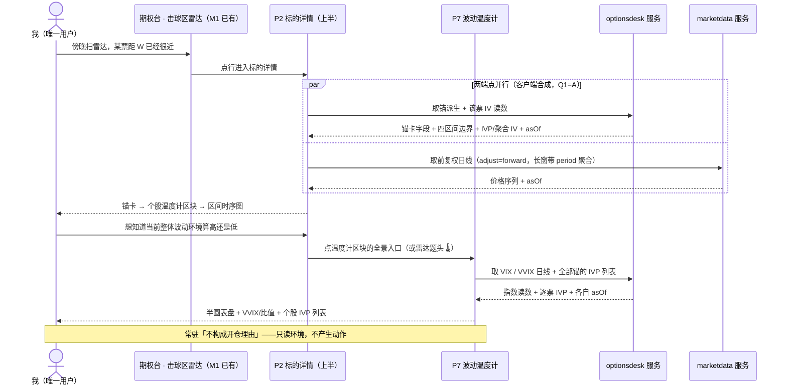

## User Journey Diagram

# Feature Specification: optionsdesk M2a — 标的详情上半 + 波动温度计

**Feature Branch**: `046-optionsdesk-detail-thermometer`
**Created**: 2026-08-02
**Lifecycle status**: 见 frontmatter `status`（[ADR-0024](../../docs/adr/0024-spec-feature-first-layout.md) 单一来源；正文不复述状态值，避免双源 drift）
**Clarify 轮次**: 2026-08-02 三轮共 **15 问**全部收敛：specify 第一轮 8 项范围边界随拆分拍板一并定、第二轮 3 项跨模块边界 / 采集宿主 / 渲染范围、clarify 阶段 4 项数据核对 / 窗口粒度 / 回填深度 / 性能预算；另**扫出并订正 1 处 drift**（IV 口径标注违反 p3 §9-1 采纳声明）。2026-08-03 analyze 复验轮再订正 1 项范围（regime 读数移除）。见 § Clarifications
**Input**: sell-put 可视化决策系统 p1 里程碑 **M2a**（[p1 §8](../../docs/private/plans/2026-07/07-23-sellput-viz-p1-requirements.md)，2026-08-02 拍板把 M2 拆为 M2a / M2b 并把 P7 并入 M2a）= **P2 标的详情上半（锚卡 + 区间时序 + 个股温度计区块）+ P7 温度计整页**。需求 SoT = p1 §5（P2 / P7 两段）+ §5.5 提醒器表；数据架构 SoT = [p3b](../../docs/private/plans/2026-07/07-30-sellput-viz-p3b-data-architecture.md) §1 时效矩阵 / §2.2 VIX·VVIX 源改判 / §4.4 六维度与工作集纪律 / §4.7 跨 ctx 接线。前片 = [045](../045-optionsdesk-anchors-radar/spec.md)（M1，`status: implemented`）。

## 背景：为什么切在这里

M2 原本是「P2 标的详情」一整页。2026-08-02 拆成 M2a / M2b，**切口是数据粒度不是页面结构**——因为依赖面恰好在这里零交叉：

|               | M2a（本片）                                                                 | M2b（下一片）                                           |
| ------------- | --------------------------------------------------------------------------- | ------------------------------------------------------- |
| 数据粒度      | **标的级**（正股日线 / 标的聚合 IV / 指数）                                 | **合约级**（链发现 + 逐日快照）                         |
| 漏采后果      | **可重拉**（`his_volatility` 回看约 3 年、CBOE 历史 CSV 从 1990 / 2006 起） | **永久缺口**（三家 vendor 均无期权 EOD 历史，p3b §6.5） |
| V9 行情权互踢 | **不依赖**（本片全 EOD 档）                                                 | **依赖**（盘中实时档位由 V9 判读）                      |

**P7 归本片的三条理由**：① 它与 P2 个股温度计区块**吃同一份数据同一个源**（p3b §1 时效矩阵「个股 IVP / IV30d」那行——其行标签是口径订正前的旧措辞，见 FR-035——的落点就写着「P2 温度计区块 · P7 列表」），分两片做等于把一个维度的采集拆两次；② 它零期权链依赖，与本片其余部分性质一致；③ M1 已把雷达题头 🌡 做成「即将可用」，是个开着的洞。

**⚠️ 本片不是「零数据活」，只是「零期权链」**。区间时序那半确实白捡（正股日线已在库、10 年深），但 IVP 与 VIX/VVIX 两条**都要本片自己建采集**。这一点在拆分讨论时已逐条对代码核过，写在这里防止 plan 阶段按「M2a 很轻」排期。

## 依赖与排期前提（硬前置，不是软假设）

### 已就绪（可直接消费，本片零改动）

| 依赖                                | 出处                     | 影响本片的什么                                                              | 状态                                                                                                                                                              |
| ----------------------------------- | ------------------------ | --------------------------------------------------------------------------- | ----------------------------------------------------------------------------------------------------------------------------------------------------------------- |
| 美股正股日线 + 10 年 backfill       | p3b §10 Phase 2 #9       | **区间时序的价格序列**                                                      | ✅ 已 ship（`21fd3c71` / #752，限频治本 `18b62bfc` / #762）；prod 实测 `marketdata.daily_bar` us **16,726 行**、最深回看 2016-04-21、逐票 vs `trading_day` 缺口 0 |
| 锚表与两级派生链                    | 045（`aa098955` / #792） | **锚卡全部字段**（V / W / L 层 / 单票上限 / 愿卖锚 / next_review 逾期判据） | ✅ 已 ship；本片**只读复用其规则纯函数，禁重造**                                                                                                                  |
| `Instrument.need_sync` 锚驱动采集闸 | p3b §10 Phase 2 #6 / #7  | **标的级 IV 维度**的工作集直接继承「有锚才采」（指数维度不挂闸，FR-027）    | ✅ 已闭环（12 条锚、闸重算双向验过）                                                                                                                              |
| 业务日期 A′（`marketDateFor`）      | #752                     | 两个新维度都是 `{us}`-only，**必须**按 us 时区求交易日                      | ✅ 已 ship，本片直接继承                                                                                                                                          |
| US 交易日历富途 L1 + 腾讯 L2        | p3b §10 Phase 1 #5       | `{us}`-only 维度的 044 静默停摆绊线                                         | ✅ 已 ship（`f44da8ce` / #746）                                                                                                                                   |

### 本片必须自建（不是白捡）

| 要建的东西                                      | 为什么现在没有                                                                                                                     | 内容                                                                                                                                                                                         |
| ----------------------------------------------- | ---------------------------------------------------------------------------------------------------------------------------------- | -------------------------------------------------------------------------------------------------------------------------------------------------------------------------------------------- |
| 维度 **`underlying_iv_daily`**                  | p3b §4.4 六维度里的待建项                                                                                                          | 富途 `get_option_underlying_overview`（`iv` / `iv_rank` / `iv_percentile` / `hv_*` 全套，≤500 codes 批量）+ `get_option_underlying_his_volatility` 增量（**单次跨度 ≤364 天 ⇒ 回填须分页**） |
| 维度 **`us_index_daily`**                       | 同上                                                                                                                               | VIX / VVIX 日线，源 = **CBOE 官方历史 CSV**（`VIX_History.csv` 含 OHLC 四列 / `VVIX_History.csv` 仅 CLOSE）                                                                                  |
| futu-shim 端点 **`/overview`** + **`/his-vol`** | shim 现有 route 仅 `/healthz` `/universe` `/kline` `/trading-days`（2026-08-02 对 `services/futu-shim/src/futu_shim/app.py` 实证） | shim 侧新增；**不加** `/chain` `/snapshot`（归 M2b —— 其签名取决于那两个维度的实现，现在写等于猜）                                                                                           |

### 🚨 合规红线（不是偏好，是禁令）

CBOE 的**盘中报价端点** `delayed_quotes/quotes/_VIX.json` / `_VVIX.json` **严禁进自动管道**（p3b E1 / E24：CBOE 站点级 Terms 有「未经书面许可不得复制 / 存储进电子检索系统」的通用禁令，且官方「获取指数数据」页明写免费的只有历史文件、盘中的官方通路是付费 feed 且无免费档）。**只有官方历史 CSV 是被授权的免费通路。** 同理，期权链的 CBOE 抓取已于 07-30 整体摘出日更管道，本片不得以任何形式恢复。

## Clarifications

### Session 2026-08-02（specify 阶段，随拆分拍板一并定的范围边界）

- **Q: M2a 与 M2b 怎么切？** → A: **按数据粒度切，不按页面结构切**。M2a = 标的级数据面（正股日线 / 标的聚合 IV / 指数），M2b = 合约级（链发现 + 逐日快照）。P2 页面因此被横切成上下半：上半（锚卡 + 区间时序 + 个股温度计区块）进 M2a，下半（意图 Tab 选约表）进 M2b。
- **Q: P7 温度计归哪片？** → A: **并入 M2a**，理由见 § 背景三条。此前它在 p1 §8 四片里无归属——病根是 M1 行「含 L 层 / 温度计条静态档」+ 依赖「VIX/VVIX 日线」的 v1 遗留措辞未随 07-29「温度计移出为独立 P7」订正，已在同次拍板中一并修掉。
- **Q: 本片要不要做盘中实时？** → A: **不做，一律 EOD + 显式 `asOf`**。p3b §4.4 把「个股 IVP 盘中读数」归在「请求时实时」档，那要在美股盘中拉起 OpenD → 撞 **V9 行情权互踢**（2026-08-03 才做三臂实验，尚未定案）。**这是本片与 V9 解耦的前提**。形态同 045 对 spot 的处置（`last_close` + 显式 `asOf`）。依据 = p1 §5 P7 自己规定温度计「不构成开仓理由」⇒ EOD 档不损决策价值。
- **Q: 盘中 IV 轮询与温度计高位提醒器（p1 §5.5 前两条）进本片吗？** → A: **不进，后置到 V9 定案后**。它们的触发形态（约 10min 轮询 + threshold-crossing + 静默期）整体依赖盘中数据面。
- **Q: VVIX 拿不到盘中值怎么办？** → A: **接受 EOD 单点**。p3b §2.2 / E27 已逐个排查：全网可用源只剩 CBOE 官方 CSV（合规通路仅历史文件）与 Yahoo（境内不通），八家商业行情 API 的文档里连 VVIX 这个词都没出现过，且 VVIX **没有可交易 ETP** 故连代理都不成立。⚠️ 连带硬约束：**VVIX/VIX 比必须在同一基准上算并标注**，禁用盘中 VIX 除以 EOD VVIX——混算的比值没有意义且会误导。
- **Q: 本片两个维度的完整性告警等级？** → A: **按「可重拉」定档，不照抄期权链**。`his_volatility` 回看约 3 年、CBOE CSV 从 1990 / 2006 起 ⇒ 漏一天可补。期权链那套「当天必须叫醒人」的最高优先级是因为**漏采即永久缺口**，本片不适用。
- **Q: 锚卡的派生值本片重算吗？** → A: **不重算，只读复用 045 已实装的规则纯函数**（confidence → L 层 → 单票上限两级链、W = 0.8V、四区间边界、愿卖锚）。本片**不提供锚编辑入口**——改锚仍去 P6 锚管理。
- **Q: 跨 ctx 读怎么走？** → A: **Q7-B 只读直查 + `CROSS-CONTEXT-READ` 注释**，禁 `@Inject()` marketdata 的 use case（Q7-C）。参照 045 已落的 `anchor-driven-sync-gate.ts` 与 ADR-0062。

### Session 2026-08-02（specify 阶段第二轮，3 问全部收敛）

- **Q1: 区间时序的前复权价格序列怎么取？（ADR-0053 sunset_trigger #2 的命中点）** → A: **mobile 端两端点合成 —— optionsdesk 不碰复权，ADR-0053 保持不动**。价格序列直接问 marketdata 既有的 `GET /v1/marketdata/instruments/:symbol/bars`（已支持 `adjust=forward` 与 `period`），optionsdesk 只供锚派生的四区间边界。

  **被否的两条**：
  - ❌ **升 `packages/` 共享包（首选方案，查证后判定物理不可行）**：server **零** `@nvy/` import、`apps/server/package.json` **零** workspace 依赖；`packages/types/src/index.ts:36-38` 已写死原因——「**server 物理无法消费本 TS-source-only 包**（swc CJS dist + 裸 node 不识 custom condition）」，022 为此被迫在 `alert/push-gateway.port.ts` 留本地副本 + 注释互指（一个一行常量都要双写）。次要阻力两条：`adjusted-bars.rules.ts` 公开类型面绑 `Prisma.Decimal`，而 Prisma 7 custom-output 下 `@prisma/client` 包入口不发布 schema 类型（`packages/types` 的 `Account` 因此是手写镜像不是 re-export）；且三个 consumer 全在 server 内，`packages/` 的定位是跨 app 共享。
  - ❌ **optionsdesk 自建复权**：算法双写必 drift。

  **另有一条本仓可行但本次不做的「B-lite」**（留档，将来真需要时直接取用）：不搬代码，把 ESLint 细分元素 `marketdata-rules` 的**点对点放行升为通用出边**（各 ctx disallow 里去掉它）+ amend ADR-0053 的 Consequences。粒度应放行到整个 `src/marketdata/*.rules.ts` 元素而非逐文件（逐文件要给每个 rules 建 element，boundaries 首匹配语义会变脆），守恒靠 ADR-0053 sunset_trigger #1 兜底（`*.rules.ts` 一旦带状态 / IO 立即重审）。**本次不做的决定性理由**：Q3 选了服务端降采样后，marketdata 的 bars 端点同时满足复权与降采样两项需求 ⇒ optionsdesk 一行复权代码都不用碰，升共享等于为不存在的消费方付成本。

  ⚠️ **本条与业界共识相反，论证记在这里防止将来被 BFF orthodoxy 质疑时找不到出处**（2026-08-02 联网 fact-check）：主流（[Sam Newman](https://samnewman.io/patterns/architectural/bff/) / [Azure Architecture Center](https://learn.microsoft.com/en-us/azure/architecture/patterns/backends-for-frontends) / [AWS Mobile](https://aws.amazon.com/blogs/mobile/backends-for-frontends-pattern/)）明确推 BFF / 服务端聚合，理由 = 客户端承担编排复杂度 + 多次网络往返抬高延迟。**但该共识的三个前提在本仓都不成立**：① 它假设 microservice 拓扑跨服务往返，我们是 modular monolith 内两个 bounded context（同进程 / 同 host / 同 TLS 连接）② 它假设多次调用是**链式**的，我们两个 GET **并行**且 HTTP/2 已开（`ops/nginx/conf.d/mono.conf:32` `:65`）⇒ 成本 ≈ `max(t1,t2)` 而非 `t1+t2`；同批资料里 [Uber 把 4 个请求并行化降约 40% 冷启动延迟](https://technori.com/news/optimize-api-response-times-mobile-apps/) 恰是反证——多请求本身不是病，链式才是 ③ BFF 的核心动机是多客户端各要不同数据形状，本项目**只有一个客户端**。**诚实记一笔**：共识指出的「客户端要自己对齐编排与错误态」这条成本在本片是**真实存在**的，只是 FR-020 本就要求锚 / 行情 / IV 各带各的 `asOf`，多一份不构成新的复杂度类型。

- **Q2: CBOE 官方历史 CSV 从哪台机器拉？** → A: **77 直连，已实测通过**（2026-08-02 在 77 上 `curl --noproxy "*"`）。港机与 shim 完全不参与，shim 职责不扩张。实测证据：`VIX_History.csv` HTTP 200 / 471 KB / **9242 行** / 3.1s，表头 `DATE,OPEN,HIGH,LOW,CLOSE`；`VVIX_History.csv` HTTP 200 / 108 KB / **5074 行** / 1.8s，表头 `DATE,VVIX`。三条交叉验证：① 两者末行均为 `07/31/2026`（上一交易日）② 行数比 p3b E2 记录的 9240 / 5072 各多 **2 行**——恰等于 E2 拉取日（07-29）之后经过的两个交易日，坐实源是活的在更新 ③ VVIX 确认**只有 CLOSE 一列**，与 FR-025 一致。
- **Q3: 区间时序的默认时间窗与长窗降采样？** → A: **默认 1 年日线（约 250 点），提供 1Y / 3Y / 5Y / 10Y 切换，长窗走服务端聚合**。实现零新增——marketdata 既有 bars 端点的 `period` 参数（`day|week|month|quarter|year`）就是聚合口径。

  🚨 **一处主动偏离业界共识，plan / impl 阶段别改回去**：联网 fact-check 显示业界推 **LTTB** 类保形降采样（[tsdownsample](https://arxiv.org/pdf/2307.05389) / [MinMaxLTTB](https://arxiv.org/pdf/2305.00332)），共识本身（「客户端降采样 = 数据传过去再丢掉，低效」）**支持服务端做**这一点我们采纳；但**股价图 MUST 用 OHLC 时间桶聚合而非 LTTB**——周 K / 月 K 是金融行业**标准口径**，LTTB 是**视觉近似**，拿它画 K 线会造出不存在的价格点。⇒ **MUST NOT 为此引入任何降采样库**（顺带撞 SC-007 零新依赖）。

### Session 2026-08-02（clarify 阶段）

- **Q: p3b §6.2 把「IVP 双算对表」标注为「常驻化」的 L3 跨源核对项，本片要不要落地？** → A: **落地，但只在采集侧告警面** —— 采集 `underlying_iv_daily` 时顺带由 `his_volatility` 自算一次并与 `overview` 直读值比对，超阈值（沿用 p3b §6.3 实测基线：硬门 5pp / WARN 2pp）进 WARN 复核名单；**UI 不呈现差异**，显示值恒为直读值。落 **FR-034**。理由 = 富途的聚合规则**未文档化**（p3 §9-1），它若悄悄改规则，这条核对是唯一能发现的信号；而数据本就要落，无额外 vendor 调用。
- **Q: 四档窗口各用哪个聚合粒度？（FR-008 定了档位、FR-009 定了走服务端聚合，但映射未定）** → A: **1Y=day / 3Y=week / 5Y=week / 10Y=month**（bar 数约 252 / 156 / 260 / 120），落 **FR-009**。**先联网查过再定**：业界**无唯一标准** —— Barchart 文档化默认是 1Y=daily / 5Y=monthly，TradingView 的 1Y 却是 weekly，同一档两家相反；连"可读区间"的具体 bar 数都没共识（52 到 252 都有）。收敛的只有原则「range 决定 interval、把 bar 数压进可读区间」。⇒ 按本片场景（价值锚定的多年走位，日内结构无关）取**各档密度尽量一致**为目标函数，落在 120–260 窄带。与 Barchart 的唯一分歧在 5Y 用周而非月（5 年是复盘常用窗，月 K 糊掉季度级波动；且那套在 5Y→10Y 处密度反向跳变）。
- **Q: `underlying_iv_history` 首次上线回填多深？** → A: **拉满 vendor 上限（约 3 年）**，不是只拉 IVP 所需的 252 交易日下限。落 **FR-024**。决定性理由 = **不可逆性**：`his_volatility` 的 3 年是**滑动窗**，今天不拉、明年再要中间那段就永久没了（与期权 EOD 缺口同形，只是窗更宽）。次要收益 = 上线当天 12/12 全部可算 IVP、分位样本更稳；成本可忽略（12 只 × 约 3 页 ≈ 36 次请求）。
- **Q: `perf_budgets` 取哪一档？** → A: **直接套 045 已用真实测数校准的同类档位**，不再走一遍「先验 → 校准」。详情页锁定读 40/80、温度计页读 50/100（落 frontmatter）。理由：Q1 把序列读划给了 marketdata 既有 bars 端点 ⇒ 本片两个端点都退化成「JWT 守卫 + 限流 + 单次 PG 读 + 小 DTO」，与 045 的 `GET anchors` / `radar` 结构同类，原先「本片含序列读、形态与 045 点查不同」的顾虑随 Q1 消失。⚠️ 045 的先验值（radar 250/500）实测**高估 3-6 倍**，这正是本次不从先验起手的原因。端点路径为暂定值，impl 后对 `openapi.json` 核实（045 同款处置）。
- **🔧 顺带扫出并订正的 drift（非提问项）**：本 spec 早期草稿沿用 p1 的「IV 30d」措辞，与 **p3 §9-1 的口径采纳声明冲突** —— 该声明明写数据源是富途**标的聚合 IV 序列**、**非严格 30d-ATM 锁定口径**，且要求「App 展示与文档标注一律写『富途标的聚合 IV』」。全文已订正为「聚合 IV」并落 **FR-035** 作为硬约束（对 p3b / p1 原文的**引用**保留其字面措辞并加注，避免错引）。

### Session 2026-08-03（analyze 复验轮，1 项范围订正）

- **Q: P7 的 `regime` 读数按什么口径算？**（FR-015 原写「口径引 vault 术语口径 §8，MUST NOT 在代码里自造」）→ A: **本片不呈现该字段**。逐条查 vault 后发现原提法的**前提不成立**，三处一手依据彼此一致：
  - `sell-put-术语口径.md` §8：regime X = 数年一遇系统性事件（**如** VIX 触 60）：**通过市场温度计标识出来**。「如」是例示，全文未给 N/X 的机械边界；而「通过温度计标识」指的就是本片 P7 ⇒ **spec 引 vault、vault 指回温度计，是一个闭环引用，两端都没有落点**。
  - `B流-投资体系.md` 时机层：「波动常年存在，**regime X 只是温度计的极致读数**」—— 指数看 VIX/VVIX、个股看 IVP/IVR，**全程展示供人参考判断、不构成开仓理由**。
  - `B流-修订日志.md` 2026-07-29 拍板：「波动**连续谱**：常年有波动、regime X = 极致读数」，温度计**无 gate**。

  ⇒ 把它做成 server 算出、UI 显示的离散 `N`/`X` 字段，等于给一个被明确定性为「连续谱 + 人判 + 无 gate」的东西造一个硬开关，顶撞 07-29 拍板。**P7 呈现温度计本体即可**（VIX 表盘 / VVIX / VVIX-VIX 比 / IVP 列表），regime 由人读表盘自行判定。

  **被否的三条**：❌ 把 §8 的「如 VIX 触 60」升为硬阈值 —— 把例示当判据，且须同时回写 vault §8 才能自洽；❌ 保留字段但改成 VIX 档位文字标签 —— 与表盘信息冗余，且 vault 里 N/X 带「判据切换 + 费率放大 2-3×」的策略语义，拿它命名波动档位是二次误读；❌ 保留 N/X 但值靠人工设定 —— 本片只读、无编辑入口 ⇒ 恒显 N，实为占位字段。

  ⚠️ **mockup drift 不回改**：`design/046-thermometer.dc.html` 帧⑦ 画了 `regime N`。per `sdd.md`「代码是真相源，`design/` 是历史决策留痕，不要求与最终 RN 代码逐 pixel 同步」。

## User Scenarios & Testing

### User Story 1 — 单票全景：这只票的价格在哪、波动在哪（Priority: P1）

从雷达点进某只票，一屏读出三件事：锚是什么（V / W / L 层 / 复审状态）、价格历史相对四区间走到哪了、这只票当前的波动位置高不高。读完就能判断「今天这只票值不值得进一步看腿」——而不必等选约表。

**Why this priority**: 这是 M1 雷达之后最直接的下一跳，也是本片唯一从头到尾自洽的用户价值。没有它，雷达点行进去是空的。

**Independent Test**: 建一条锚 + 该票有日线与 IV 读数，从雷达点行进入，验证锚卡 / 个股温度计区块 / 区间时序三块按 07-29 拍板的版式自上而下渲染，且每块的数据陈旧度各自标注。**不依赖任何期权链数据**。

**Acceptance Scenarios**:

1. **Given** 某票有锚且当日日线与 IV 均已落库，**When** 从雷达点该行，**Then** 锚卡显示 V / W=0.8V / confidence → L 层 / method / asof / next_review / 单票上限 / 仓位水位档；区间时序显示价格线 + 四区间背景带；个股温度计区块显示 IVP + 分段水平条 + 聚合 IV。
2. **Given** 该票的 IV 数据停在上一交易日，**When** 打开详情，**Then** 温度计区块显示该值并带显式 `asOf`「数据截至 X · 收盘」，**不**静默呈现为当日值。
3. **Given** 该票 next_review 已逾期，**When** 打开详情，**Then** 锚卡出红标（拒绝交易语义），判据与 045 雷达徽标一致。
4. **Given** 该票当前持股，**When** 打开详情，**Then** 锚卡加显愿卖锚（长持 1.2V / 收租 1V）；未持股时该行不出现。 ⚠️ **本片只有「未持股」半边可达** —— 持仓规模的数据面属 M3 / M4，本片无通路，plan D9 已定死该行恒不出现。「持股」半边随持仓数据接入后再验，本片不作验收门。
5. **Given** 该票 IV 历史窗口不足 252 交易日，**When** 打开详情，**Then** 温度计区块显式「分位不可算」，**不**回落为 0、**不**隐藏区块。

---

### User Story 2 — 波动环境全景：现在整体算高波还是平静（Priority: P1）

从雷达题头 🌡（M1 已埋的入口，当前是「即将可用」）或详情页温度计区块的全景入口进入 P7，一屏看到指数级波动位置（VIX 表盘 + VVIX + VVIX/VIX 比）与全部锚定标的的 IVP 排布。**只读环境、不产生动作**——页面常驻「不构成开仓理由」。

**Why this priority**: 与 US1 同为 P1，因为它是本片把 M1 那个「即将可用」的洞补上的唯一途径，且与 US1 共用同一份 IV 数据（分开做等于采两次）。

**Independent Test**: 有 VIX / VVIX 日线与至少一条锚的 IVP 读数时进入该页，验证表盘分段 / 指针 / 大数值、VVIX 与 VVIX/VIX 比、IVP 列表逐行渲染，且「不构成开仓理由」文案常驻可见。

**Acceptance Scenarios**:

1. **Given** VIX 与 VVIX 均有当期值且属同一交易日，**When** 打开温度计页，**Then** 半圆表盘按平静 <20 / 抬升 20-30 / 高波 >30 分段着色、指针落位、大数值可读；旁列 VVIX 当前值与 VVIX/VIX 比（正常带 4-6）。
2. **Given** VVIX 缺当期值而 VIX 有，**When** 打开温度计页，**Then** 表盘正常渲染，VVIX 与 VVIX/VIX 比两处**各自**显式「不可用」，**不**用 VIX 单独推算比值。
3. **Given** VIX 与 VVIX 的最新可得日期不是同一天，**When** 打开温度计页，**Then** 比值**不计算**并显式标「基准不一致」，两值各带自己的 `asOf`。
4. **Given** 有 5 条锚且其中 2 条窗口不足，**When** 查看 IVP 列表，**Then** 3 条显示 IVP 数值 + 水平条，2 条显示「分位不可算」，5 条**都在列表里**（不因不可算而消失）。
5. **Given** 一条锚都没有，**When** 打开温度计页，**Then** IVP 列表区显示空态并引导去锚管理建锚；指数表盘部分照常渲染（它不依赖锚）。

---

### User Story 3 — 波动数据每天自己进来（Priority: P1）

个股 IV 与指数日线每个交易日自动落库，工作集自动跟随锚——加第 13 只锚时，它的 IV 数据在下一轮采集后自动出现，无需改代码、无需人工 SQL。

**Why this priority**: 与 US1 / US2 同为 P1 而非降为 P2，因为**没有它前两个 story 全是空页**。本片的数据面必须自建，这也是本片与「M2a 很轻」这一误解的分界线。

**Independent Test**: 在集成测试内造 N 条锚（含新增一条），跑两个新维度的采集，验证请求只发给有锚的标的、落库幂等、新增锚在下一轮自动纳入。

**Acceptance Scenarios**:

1. **Given** 12 条锚开闸、库里有近两万只 us 标的，**When** IV 维度跑一轮，**Then** 请求只覆盖那 12 只（工作集取自锚白名单，**禁** `market IN scope`）。
2. **Given** 已跑过一轮，**When** 同日再跑一轮，**Then** 幂等（唯一键覆盖写，不产生重复行）。
3. **Given** 新增第 13 条锚，**When** 下一轮采集，**Then** 该票 IV 自动纳入，零代码改动、零人工 SQL。
4. **Given** 需要回填某票 3 年 IV 历史，**When** 执行回填，**Then** 按单次跨度 ≤364 天分页请求，分页边界不重复计入、不漏日。
5. **Given** 当日 vendor 不可达，**When** 采集跑完，**Then** 该维度记失败并按「可重拉」等级告警，已落历史不动，次日重跑可补齐。
6. **Given** 采集在北京时间凌晨触发（美股前一交易日收盘后），**When** 求值业务日期，**Then** 按 us 市场时区求交易日（A′），**不**沿用全局上海日期。

---

### User Story 4 — 温度计入口从「即将可用」转真（Priority: P2）

M1 在雷达题头留的 🌡 入口当前点进去是占位。本片把它接到真的 P7 页面。

**Why this priority**: P2——它是 US2 的导航壳，US2 的页面本身才是价值主体；且入口切换是小改动，可独立验证。

**Independent Test**: markets 开关 ON 时点雷达题头 🌡 直达温度计页；OFF 时随期权台 tab 一并不可达（路由级 guard），与 045 同构。

**Acceptance Scenarios**:

1. **Given** markets 开关 ON，**When** 点雷达题头 🌡，**Then** 进入 P7 温度计页，「即将可用」占位不再出现。
2. **Given** markets 开关 OFF（合规公开版），**When** 尝试深链直达详情页或温度计页，**Then** 路由级 guard 拦截，与 045 期权台 tab 同构。

---

### Edge Cases

- 从非雷达路径（如深链）进入某个**没有锚**的标的详情 → 显式「该标的尚未建锚」+ 建锚入口，不是空白页也不是报错页。
- 区间时序所选窗口内**发生复权事件** → 序列按前复权口径连续；与雷达使用的未复权 `last_close` 存在口径差异，同屏需可解释（不能出现「详情图上的最新价与雷达显示的价对不上且无解释」）。
- 该票**有锚但无任何日线**（新开锚、首个 cron 未跑完）→ 区间时序显式空态，但**四区间背景带仍可单独呈现**（边界只依赖锚，不依赖行情）。
- 价格序列**短于所选时间范围**（如只有 3.5 个月历史的新增锚）→ 按实际可得区间渲染并标明实际起点，不拉伸补空、不静默截断。
- IVP 与聚合 IV **可有两个来源**（vendor 直读 vs 由历史序列自算，p3b §6.2 已把两者定为 L3 有限跨源核对项，实测差 ±2pp）→ 显示口径必须单一且可追溯，不得两个来源混用而不标注。
- 温度计页的 IVP 列表包含 `excluded = true` 的锚 → **照常列出并标记**（沿用 045 语义：锚 = 采集意愿、`excluded` = 交易意愿，采集照常）。
- 长窗口（如 10 年日线约 2500 点）在移动端渲染 → 走服务端 OHLC 时间桶聚合（FR-009），不把全量日线送到客户端再抽稀。

## Requirements

### Functional Requirements

**P2 标的详情（上半）**

- **FR-001**: 系统 MUST 提供单标的详情视图，自上而下依次为**锚卡 → 个股温度计区块 → 区间时序图**（07-29 拍板版式，p1 §5 P2）。
- **FR-002**: 锚卡 MUST 呈现 V / W=0.8V / confidence（10 分制）→ L 层 / method / asof / next_review / 单票上限 / 当前仓位水位档；持股时 MUST 加显愿卖锚（长持 1.2V / 收租 1V）。 ⚠️ **本片只实现「未持股」半边** —— 持仓规模的数据面属 M3 / M4，本片无通路 ⇒ 愿卖锚行恒不出现、仓位水位档恒呈现「未知 · 待接入」（**禁显 0**，plan D9 已定死）。「持股」半边不在本片验收面内。
- **FR-003**: 锚卡的一切派生值 MUST 复用 045 已实装的规则纯函数（两级链 confidence → L 层 → 单票上限、W、四区间边界、愿卖锚），MUST NOT 在本片重新实现。
- **FR-004**: 锚卡 MUST 呈现人工覆盖态标记（L 层 / 单票上限处于人工态时显示「人工调整 · 下次上游刷新将回落」），与 045 锚表单同语义；本片为**只读呈现**，MUST NOT 提供锚编辑入口。
- **FR-005**: `next_review` 逾期时锚卡 MUST 出红标（拒绝交易语义），判据与 045 雷达徽标一致。
- **FR-006**: 区间时序图 MUST 呈现价格线 + 四区间背景色带（GuruFocus / Stock Rover 范式），区间边界由锚派生。
- **FR-007**: 区间时序的价格序列 MUST 取自既有正股日线数据，且 MUST 按前复权口径呈现（跨复权事件连续）。**取数路径 = 客户端两端点合成**（Q1 = A）：价格序列由客户端直接向 marketdata 既有的 bars 读端取（前复权 + 聚合周期均由该端点承担），optionsdesk 只负责锚派生的四区间边界。⇒ **optionsdesk MUST NOT 实现或 import 任何复权换算逻辑**，ADR-0053 的点对点边保持原样不动。
- **FR-008**: 区间时序 MUST 默认呈现近 1 年日线，并提供 1Y / 3Y / 5Y / 10Y 窗口切换。
- **FR-009**: 长窗口 MUST 走**服务端时间桶聚合**而非把全量日线送到客户端再抽稀。**窗口 → 粒度映射固定为**：`1Y → day`（约 252 根）/ `3Y → week`（约 156）/ `5Y → week`（约 260）/ `10Y → month`（约 120）。选型依据 = **各档视觉密度尽量一致**（bar 数落在 120–260 的窄带），而非抄某家平台——2026-08-02 联网查证**业界无唯一标准**：[Barchart](https://www.barchart.com/trader/help/chart/time.php) 文档化的默认是 1Y=daily / 5Y=monthly，[TradingView](https://www.tradingview.com/support/solutions/43000747934-time-intervals-a-quick-introduction-and-tips/) 的 1Y 却是 weekly，同一档两家相反；收敛的只有原则「range 决定 interval，把 bar 数压进可读区间」。**与 Barchart 的唯一分歧在 5Y（周 vs 月）**：本片图的用途是看多年相对 W / V 的走位，5 年是复盘常用窗，月 K 会糊掉季度级波动；且 Barchart 那套在 5Y(60) → 10Y(120) 处密度反向跳变。⚠️ 聚合口径 MUST 是 **OHLC 时间桶**（金融行业标准语义），MUST NOT 使用 LTTB 一类**视觉保形**降采样——后者会造出不存在的价格点；且 MUST NOT 为此引入任何降采样库（见 SC-007）。
- **FR-010**: 切换窗口 MUST NOT 改变四区间背景带的边界（边界只依赖锚，与时间窗无关）；窗口内价格超出四区间显示范围时，纵轴 MUST 容纳实际价格区间而非裁掉数据。
- **FR-011**: 标的无锚时详情页 MUST 显式提示并给出建锚入口，MUST NOT 呈现空白页或错误页。

**个股温度计区块与 P7 温度计页**

- **FR-012**: 个股温度计区块 MUST 呈现 IVP 值 + 分段水平条 + 聚合 IV + 提醒状态，并提供通往 P7 的全景入口。
- **FR-013**: IVP MUST 优先于 IVR 呈现（锁 tenor + moneyness 口径，p1 §5 P7）。**可验证判据 = IVR（`iv_rank`）只落库不上屏** —— 采集侧照常存 vendor 直读的 `iv_rank`（FR-023），但详情页与 P7 列表的呈现字段里 MUST NOT 出现它。
- **FR-014**: IV 历史窗口不足以计算分位时，系统 MUST 显式呈现「分位不可算」，MUST NOT 回落为 0、MUST NOT 隐藏该区块、MUST NOT 呈现上一次的值而不标注。
- **FR-015**: P7 页 MUST 呈现 VIX 半圆表盘（绿 / 黄 / 红分段 = 平静 <20 / 抬升 20-30 / 高波 >30，含指针与大数值），旁列 VVIX 当前值、VVIX/VIX 比（正常带 4-6）。 📌 **本片 MUST NOT 呈现 regime N/X 读数**（2026-08-03 analyze 复验扫出、user 拍板）—— vault §8 未给出 N/X 的机械判据，且把它定性为「温度计的极致读数 + 人判 + 无 gate」；p1 §5 P7 的「regime 读数（N/X）」措辞不在本片实现面内。三处一手依据与被否的三条替代方案见 § Clarifications。
- **FR-016**: VVIX/VIX 比 MUST 在同一基准（同一交易日）上计算并标注基准；两侧基准不一致时 MUST NOT 计算该比值，改为显式标注。
- **FR-017**: 指数数据不可得时 MUST 显式呈现「显示不可用」，MUST NOT 让指针停在 0、MUST NOT 沿用上一交易日值而不标注。
- **FR-018**: P7 页 MUST 呈现全部锚定标的的 IVP 列表（ticker + IVP 水平条 + 聚合 IV + 提醒状态），且「分位不可算」的行 MUST 保留在列表内。
- **FR-019**: P7 页 MUST 常驻「不构成开仓理由」文案（p1 §5 P7 与 master 07-29 拍板）。
- **FR-020**: 本片全部行情与波动读数 MUST 带显式 `asOf`，陈旧时 MUST 呈现「数据截至 X · 收盘」，MUST NOT 静默当作当日实时值。
- **FR-021**: 雷达题头 🌡 入口 MUST 由「即将可用」占位改为直达 P7 页。
- **FR-022**: 详情页与温度计页 MUST 随期权台 tab 一并受 markets 合规开关门控（路由级 guard），与 045 同构。

**数据采集**

- **FR-023**: 系统 MUST 新增标的级 IV 日更采集能力，落 vendor 提供的 `iv` / `iv_rank` / `iv_percentile` / `hv_*` 全套字段，并支持历史波动率序列的增量与回填。
- **FR-024**: 历史波动率序列回填 MUST 按 vendor 单次跨度上限（≤364 天）分页请求，分页边界 MUST NOT 重复计入或漏日。**首次上线 MUST 拉满 vendor 可回看的全部历史（约 3 年）**，而非只拉 IVP 所需的 252 交易日下限。**决定性理由 = 不可逆性**：`his_volatility` 的 3 年是**滑动窗**，今天不拉、明年再想要中间那段就永久没有了（与期权 EOD「漏采即永久缺口」同形，只是窗口更宽）。次要收益：上线当天 12/12 全部可算 IVP 而非等一年；分位样本越长越稳。成本可忽略（12 只 × 约 3 页 ≈ 36 次请求，一次性）。
- **FR-025**: 系统 MUST 新增 VIX / VVIX 日线采集能力，源为 CBOE 官方历史 CSV。⚠️ **MUST NOT** 使用 CBOE 盘中报价端点（ToS 禁令，见 § 合规红线）。VVIX 仅有 CLOSE 一列，存储 MUST 允许其余 OHLC 列为空而非填 0。
- **FR-026**: **标的级 IV 维度**的工作集 MUST 取自锚白名单（继承 `need_sync` 采集闸），MUST NOT 按 `market IN scope` 取全量（否则工作集从 12 只炸到约 19,465 只）。
- **FR-027**: **指数维度的工作集 MUST NOT 挂锚闸** —— 它是**指数级**的，工作集 = VIX / VVIX 两个固定代码，与锚表无关。⚠️ 挂了不只是多余：**零锚时指数采集会静默不跑**，与 FR-018 空态分支（「指数表盘不依赖锚，零锚时照常渲染」）直接矛盾。 📌 **本条是 2026-08-02 plan 阶段（D1）扫出并经 user 拍板的订正**：FR-026 原文写「两个新维度」，但其论证前提（工作集炸到 19,465 只）**只在标的级维度上成立** —— 指数维度只有 2 个代码，不存在爆炸风险，也不存在「无锚不采」的语义。
- **FR-028**: 两个新维度的业务日期 MUST 按 us 市场时区求值（继承 A′ `marketDateFor`），MUST NOT 沿用全局上海日期。
- **FR-029**: 采集 MUST 幂等（同日重跑不产生重复行）。
- **FR-030**: 采集失败 MUST 告警且不破坏已落历史数据；告警等级按「可重拉」定档，MUST NOT 照抄期权链的「当日必须叫醒人」最高优先级。
- **FR-031**: 新增锚 MUST 在下一轮采集自动纳入两个新维度的工作集，MUST NOT 需要代码改动或人工 SQL。
- **FR-032**: 跨 bounded context 读取 MUST 走只读直查 + `CROSS-CONTEXT-READ` 注释（Q7-B），MUST NOT 注入他 context 的 use case（Q7-C）；跨 context 写永远禁止。
- **FR-033**: 本片 MUST NOT 引入任何盘中实时取数路径（含 IV 盘中轮询、盘中指数报价）——它们后置到 V9 定案。
- **FR-034**: 采集 `underlying_iv_daily` 时 MUST 顺带由 `his_volatility` 序列自算一次 IVP，与 `overview` 直读值比对（p3b §6.2 的 L3 有限跨源核对，"常驻化"）。差异超阈值 MUST 进 WARN 复核名单——阈值沿用 p3b §6.3 已给的实测基线（硬门 5pp / WARN 2pp）。⚠️ 该核对 **MUST 只作用于采集侧告警面，MUST NOT 进入 UI**：界面显示的 IVP 恒为 `overview` 直读值（口径单源，见 FR-035），自算值只用于发现口径漂移。**存在理由**：富途的聚合规则**未文档化**（p3 §9-1），它若悄悄改了规则，这条核对是唯一能发现的信号。

**口径与标注**

- **FR-035**: 个股 IV 读数的**显示口径单源** = 富途 `overview` 直读值。且界面与文档标注 MUST 写「**富途标的聚合 IV**」，**MUST NOT 写「IV30d」或任何暗示 30 天 / ATM 锁定的措辞** —— p3 §9-1 的口径采纳声明明写该序列**非严格 30d-ATM 锁定口径**（富途未文档化其 tenor / moneyness 聚合规则），标成 IV30d 等于宣称一个数据源并不保证的口径。 ⚠️ p1 §5 P2 / P7 的「IV 30d」措辞是 p3 口径调研**之前**的写法，已被 §9-1 取代；本 spec 早期草稿沿用了它，2026-08-02 clarify 阶段扫出并订正。
- **FR-036**: 个股 IVP 的**阈值档边界固定为 25 / 70 / 90**（四档：`<25` 低 / `25–70` 中 / `70–90` 高 / `≥90` 极高）。FR-012 与 FR-018 的「提醒状态」MUST 由该档位派生 ——「未越阈值档」(IVP<70) /「已越高档」(70≤IVP<90) /「已越极高档」(IVP≥90)，**MUST NOT 另立第二套阈值**；IVP「分位不可算」时该徽标 MUST NOT 出现（无 IVP 即无档位）。 📌 **依据 = mockup baseline 的分段条段宽**（`s-lo` 25% / `s-mid` 45% / `s-hi` 20% / `s-xhi` 10%，两帧共 6 处一致）。同组刻度标签 `0/50/90/100` 与段宽对不上，**以段宽为准**（2026-08-02 analyze 扫出、user 拍板），impl 时把刻度对齐到 25/70/90。 ⚠️ 本片只呈现档位，**不含提醒发送链路**（随提醒器一并后置到 V9，见 § Assumptions）。

### Key Entities

- **UnderlyingIvDaily**：标的级波动读数的逐日快照。键 = (标的, 交易日)。含 vendor 直读的 IV、IV rank、IV percentile 与各档 HV。用途 = 个股温度计区块与 P7 列表。
- **UnderlyingIvHistory**：标的级历史波动率序列（IV / HV / 标的价），供 IVP 自算与双算对表（p3b §6.2 L3 核对项，实测双算差 ±2pp）。
- **UsIndexDaily**：指数日线。键 = (指数代码, 交易日)。VIX 含 OHLC 四列，VVIX 仅 CLOSE。用途 = P7 半圆表盘与 VVIX/VIX 比。
- **Anchor**（045 已有，本片只读）：提供 V / W / L 层 / 单票上限 / 愿卖锚 / next_review 与四区间边界。
- **DailyBar**（marketdata 已有，本片只读）：区间时序的价格序列来源。

## Success Criteria

- **SC-001**: 从雷达点进某票到读完「锚在哪 / 价格在哪 / 波动在哪」三件事，在 15 秒内完成（不含首屏加载的网络时间）。**本条不作本片验收门** —— 它是真数据到位后的主观计时，与 045 的 SC-001 同性质（该片也显式标为非验收门）。
- **SC-002**: 详情页与温度计页的每一处数据读数都带可见的时点标注；抽查任意一屏，**零**处出现「无法判断这个数是哪天的」。
- **SC-003**: 全部锚定标的在采集跑通后的次日，IVP 与聚合 IV 有值或显式「分位不可算」二者必居其一——**零**处空值、**零**处 0 值冒充。
- **SC-004**: 新增一条锚后，无需任何代码改动或人工 SQL，其 IV 数据在下一轮采集后出现。
- **SC-005**: 两个新维度的日更采集在 12 只锚规模下，单轮墙钟耗时不超过 5 分钟（对照基线：`us_equity_bar` 7 票约 1 分钟）。
- **SC-006**: 采集侧对非锚定标的的请求数为 **0**（工作集闸生效的可验证判据）。
- **SC-007**: 实现引入的新第三方运行时依赖数 = **0**（沿 045 先例；仓内已装的 `react-native-svg` 可用，不算新增）。
- **SC-008**: 本片零盘中实时取数路径——代码中不存在任何在美股交易时段主动拉起行情网关的调用（与 V9 解耦的可验证判据）。

## Assumptions

- **性能预算已在 clarify 定档**（本条原是 clarify **之前**的假设，已被推翻，改写留档防误读）：原假设「本片端点含一次序列读、形态与 045 的点查不同 ⇒ 不直接套用其已校准数值」**不成立** —— Q1 把序列读划给 marketdata 既有 bars 端点后，本片两个端点都退化成「JWT 守卫 + 限流 + 单次 PG 读 + 小 DTO」，与 045 的 `GET anchors` / `radar` 同类。⇒ **直接套 045 已用真实测数校准的档位**（详情读 40/80、温度计读 50/100），见 frontmatter `perf_budgets` 与 § Clarifications。
- **本片只读锚、不写锚**：改锚仍走 P6 锚管理（045 已实装）。详情页出现的一切锚字段均为呈现。
- **仓位水位档的数据来源**：p1 §5 P2 把「当前仓位水位档」列为锚卡字段，但其输入（持仓规模）属 M3 / M4 的数据面。本片假定其在无持仓数据时呈现为「未知 / 待接入」而非 0，与 045 对缺数的处置一致。同理「持股时加显愿卖锚」在持仓数据接入前恒不显示。
- **提醒状态的呈现**：个股温度计区块与 P7 列表的「提醒状态」在本片呈现为**静态状态**（是否越过阈值档，**边界见 FR-036**），不含提醒的发送链路——发送属 Alert Engine 对接，随盘中轮询一并后置到 V9 之后。
- **regime 读数本片不做**（本条原写「引 vault 术语口径 §8，本片不自造判定规则」，2026-08-03 analyze 复验时逐条比对 vault 后**推翻**，改写留档防误读）：§8 并未给出 N/X 的机械判据，且 vault 三处一致把 regime 定性为「温度计的极致读数 + 人判 + 无 gate」。⇒ P7 只呈现温度计本体（VIX 表盘 / VVIX / VVIX-VIX 比 / IVP 列表），regime 由人读表盘自行判定。完整论证与被否方案见 § Clarifications。
- **mockup-first**：本片是 UI feature ⇒ clarify 后走 `/mockup-gen` 出 `design/` baseline 再进 plan。VIX 半圆表盘与 IVP 分段水平条是新视觉范式，mockup 阶段一并锁渲染方式（045 先例：四区间色带纯 RN `View` 组合、零绘图库；半圆表盘需评估能否同样零新依赖）。

## 范围边界

**本片做**：P2 标的详情的**上半**（锚卡 + 区间时序 + 个股温度计区块）+ P7 温度计整页 + 两个标的级采集维度 + shim 两个新端点。

**本片明确不做**：

- ❌ **意图 Tab 选约表**（P2 下半：全腿 / 建仓腿·周化 / 收租腿·年化，含 bid/ask、折年、σ 距离、OI/Vol/成交额、活跃度、动作建议）——整块归 **M2b**。
- ❌ 期权链相关的一切：`option_contract` / `option_daily_snapshot` 维度、shim `/chain` `/snapshot` 端点、财报打标（`earnings_event` 维度）——**M2b**。
- ❌ 盘中 IV 轮询、温度计高位提醒器接 Alert Engine——**等 V9 定案**。
- ❌ P3 仓位与许愿单 / P4 持仓 / P5 复盘归因。
- ❌ regime X 恐慌增强器面板（p1 §9 二期 backlog 第 6 条）；**连带 regime N/X 读数本身也不呈现**（2026-08-03 拍板，理由见 § Clarifications 与 FR-015 📌）。
- ❌ 锚的编辑（仍在 P6）。

## 三条不要在下游阶段被"优化"掉的决定

collect 自 § Clarifications，逐条给出**改动它会坏在哪**，供 plan / mockup / impl / analyze 各阶段自查。

1. **optionsdesk 不碰复权**（Q1 = A）。看起来"详情页发两个请求不如后端聚合一个"，但把序列搬进 optionsdesk 端点会连带：跨 ctx 读 `adjustment_factor` + 在 optionsdesk 内重做一遍 `period` 聚合（跨 ctx 调 marketdata use case 是 Q7-C 明禁）+ 触发 ADR-0053 重审。**它省下的只有一次并行 GET**（HTTP/2 同连接多路复用，`max` 而非 `sum`）。业界 BFF 共识与本决定相反，前提差异的完整论证在 § Clarifications Q1。
2. **长窗聚合用 OHLC 时间桶，不用 LTTB**（Q3）。业界降采样文献推 LTTB，看起来该照办——但那是**视觉保形**算法，用在 K 线上会造出不存在的价格点；周 K / 月 K 才是金融行业标准口径，且既有 bars 端点已实装。
3. **一律 EOD + `asOf`，零盘中实时**（第一轮 Q3）。IVP 盘中读数在 p3b §4.4 里归"请求时实时"档，看起来顺手就能做——但那要在美股盘中拉起 OpenD，撞尚未定案的 V9 行情权互踢。**这是本片能与 V9 并行推进的唯一原因**，松掉它本片就得排在 V9 后面。
